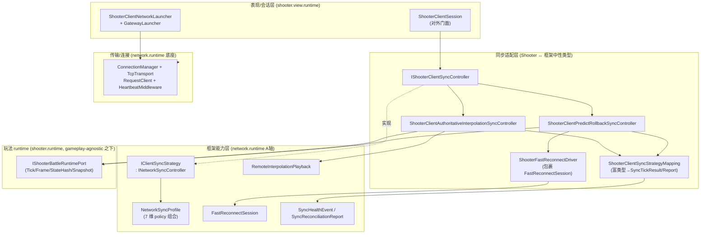
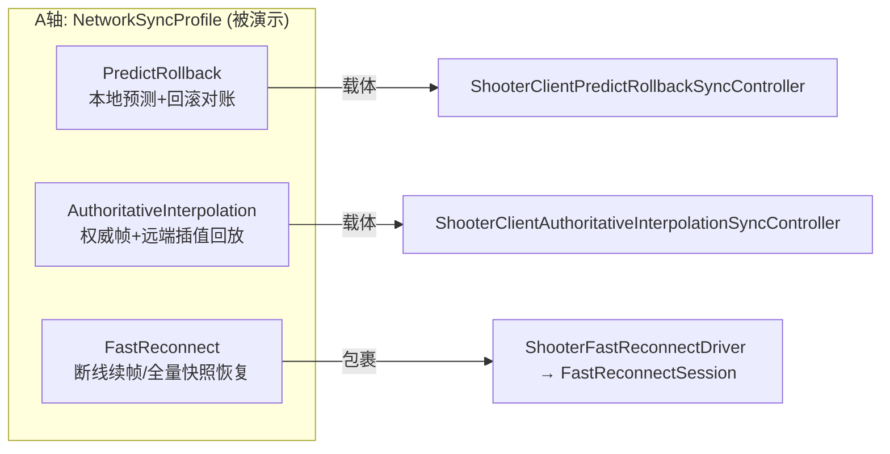
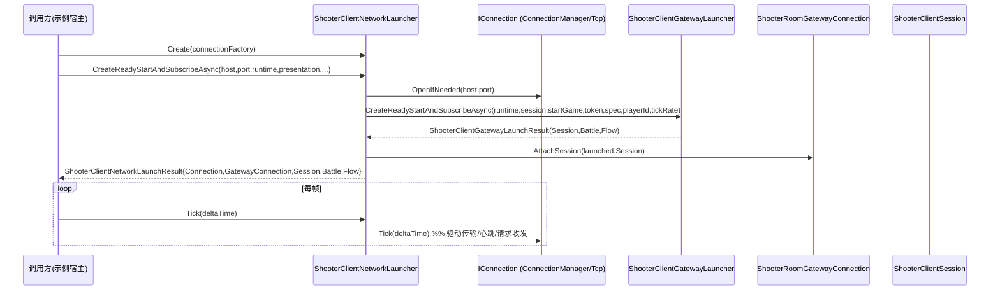
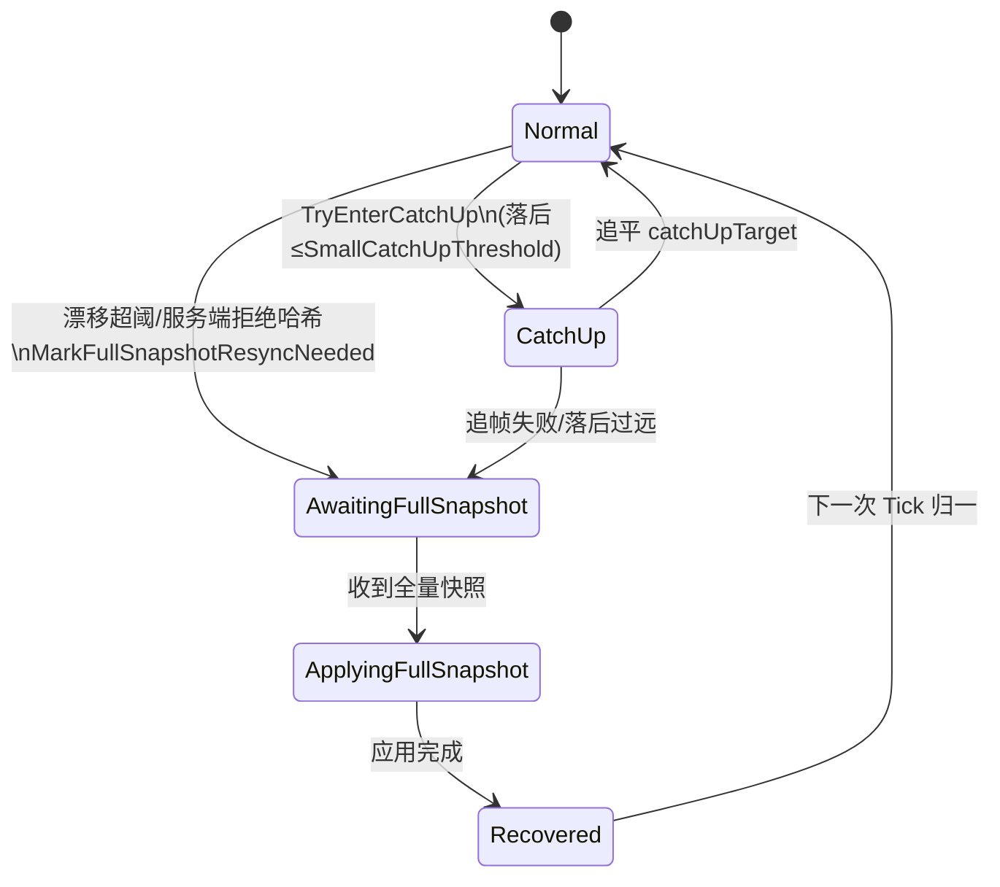
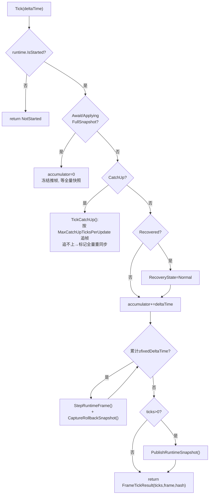
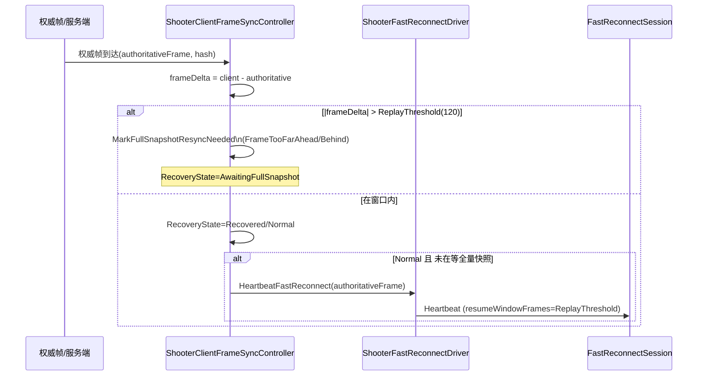
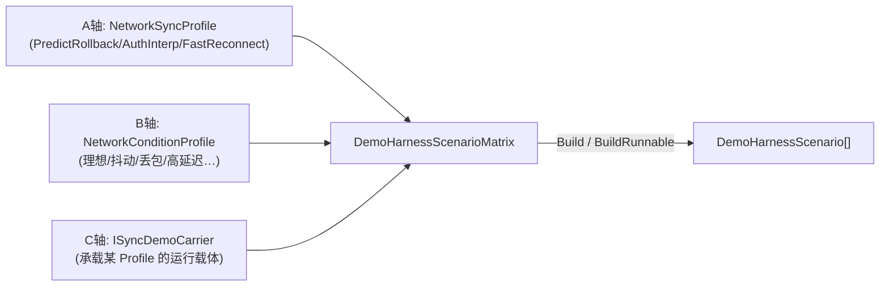
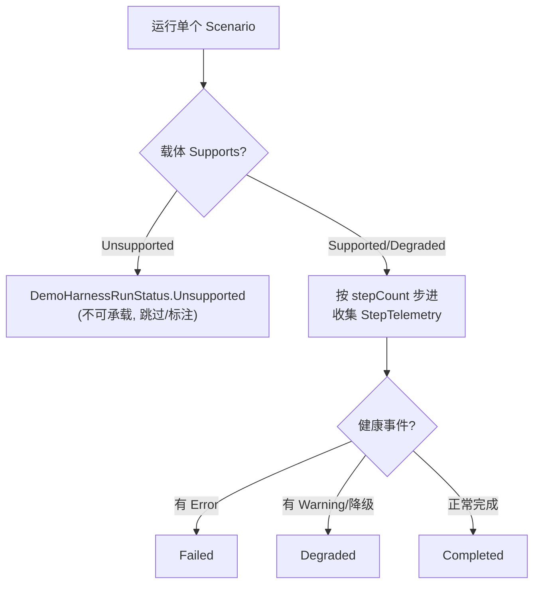
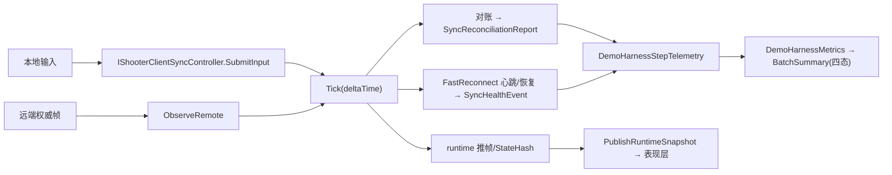

# Shooter 同步能力演示流程与设计

> 本文档面向「Shooter 示例作为框架网络同步能力演示工程」这一定位，系统梳理：示例如何把框架（`com.abilitykit.network.runtime`）提供的各类同步能力接入、串联、并以可观测的方式演示出来。包含分层架构、连接/启动链路、每帧对账/恢复流程、DemoHarness 能力矩阵运行模型，以及当前已演示能力与未覆盖能力的差距清单。
>
> 配套基线文档：[`Docs/网络同步抽象审计与能力矩阵.md`](网络同步抽象审计与能力矩阵.md)（能力矩阵与验收基线 §10）、[`Docs/Shooter重连接入FastReconnect改造设计.md`](Shooter重连接入FastReconnect改造设计.md)（FastReconnect 接入）。

---

## 1. 演示定位与设计原则

Shooter 示例不是「一个射击游戏」，而是「框架同步能力的可运行展柜」。其设计遵循三条原则：

1. **gameplay 与同步策略解耦**：射击玩法（runtime）只产出帧、输入、状态哈希、快照；同步语义全部由框架侧策略（A 轴 `NetworkSyncProfile`）决定。示例通过适配层把玩法富类型映射成框架中性类型。
2. **包裹而非替换**：示例自有的对账/恢复/重连逻辑不被删除重写，而是被框架能力「包裹」。典型如 FastReconnect —— `ShooterFastReconnectDriver` 包裹框架 `FastReconnectSession`，玩法侧只投影状态、阈值（见 §5.3）。
3. **能力可观测**：每一项被演示的能力都必须产出可断言的诊断（`SyncReconciliationReport` / `SyncHealthEvent`），并能被 DemoHarness 在 A×B×C 矩阵下批量驱动、聚合成四态结果。

---

## 2. 分层架构总览

四层职责：

| 层 | 关键类型 | 职责 |
|----|---------|------|
| 表现/会话 | [`ShooterClientSession`](../Unity/Packages/com.abilitykit.demo.shooter.view.runtime/Runtime/Client/ShooterClientSession.cs)、[`ShooterClientNetworkLauncher`](../Unity/Packages/com.abilitykit.demo.shooter.view.runtime/Runtime/Client/ShooterClientNetworkLauncher.cs:12) | 对外门面、连接/网关启动、诊断上抛 |
| 同步适配 | `IShooterClientSyncController`、`ShooterClientSyncStrategyMapping`、`ShooterFastReconnectDriver` | 玩法富类型 ↔ 框架中性类型的双向映射 |
| 框架能力 | `IClientSyncStrategy`、`NetworkSyncProfile`、`FastReconnectSession`、`RemoteInterpolationPlayback` | 同步语义（A 轴），gameplay 无关 |
| 玩法 runtime | `IShooterBattleRuntimePort` | 纯确定性推帧、状态哈希、快照打包 |

---

## 3. 被演示的框架能力清单（A 轴 Profile）

依据基线文档 §10.1，当前**真正具备运行时落地**的 Profile 有三个，Shooter 全部接入演示。示例层不再只暴露松散的模式列表，而是通过 [`ShooterAcceptanceCatalog.SyncModeMatrix`](../Unity/Packages/com.abilitykit.demo.shooter.view.runtime/Runtime/Client/Synchronization/ShooterAcceptanceLab.cs:1) 固化「模板 → `NetworkSyncProfile` → 承载类型 → 验收准则」的正式矩阵，避免纯状态同步、帧同步与混合同步在 Unity 面板里混成同一条临时流程：

| 能力 (Profile) | policy 组合要点 | Shooter 演示载体 | 可观测诊断 |
|---------------|----------------|-----------------|-----------|
| **PredictRollback** | ClientPlayback=Predict + 回滚 + 输入重放 | `ShooterClientPredictRollbackSyncController` | `SyncReconciliationReport`（misprediction/replay） |
| **AuthoritativeInterpolation** | ClientPlayback=None + 远端插值 | `ShooterClientAuthoritativeInterpolationSyncController` + `RemoteInterpolationPlayback` | 插值诊断（`IInterpolationDiagnosticsProvider`） |
| **HybridHeroPrediction** | 本地英雄预测 + 远端对象插值 + 全量快照恢复 | `ShooterClientHybridHeroPredictionSyncController` | 本地追帧、远端插值、恢复诊断 |
| **FastReconnect** | RecoveryPolicy=ReconnectResume\|RequestFullSnapshot | `ShooterFastReconnectDriver`（包裹 `FastReconnectSession`） | `LastFastReconnectHealthEvents`（`SyncHealthEvent`） |

---

## 4. 连接 / 网关启动链路

`ShooterClientNetworkLauncher` 持有底座 `IConnection` 与 `ShooterRoomGatewayConnection`，对外暴露 Create/Join 两组「就绪→开始→订阅」一站式启动方法。

要点：
- `CreateReadyStartAndSubscribeAsync` 提供 endpoint / host+port × facade / presentationSession 四种重载，最终都汇聚到同一个 `(host,port,runtime,presentationSession,...)` 实现，内部用 `ShooterClientGatewayLauncher` 完成网关握手并 `AttachSession`。
- `Tick(deltaTime)` 仅驱动连接底座（传输、`HeartbeatMiddleware`、`RequestClient`）；玩法推帧与对账由同步控制器的 `Tick` 单独驱动（见 §5）。
- 安全提示：示例的连接工厂走明文 TCP、无鉴权之外的访问控制，仅适用于演示；生产接入需补鉴权与传输加密。

---

## 5. 每帧同步主循环（以 PredictRollback 控制器为核心）

`ShooterClientFrameSyncController.Tick(deltaTime)` 是同步主循环，按恢复状态机分流。

### 5.1 恢复状态机

### 5.2 Tick 分流流程

要点与一处实现现状提示：
- `fixedDeltaTime` 由 `tickRate` 推算，时间步进**不由框架时间锚族**（`SyncTimeAnchor`/`SyncClock`/`ServerClockEstimator`/`TimeSyncBridge`）驱动 —— 这是「文档声明 vs 实现」的一处差距（见 §8）。
- 每步推帧后 `CaptureRollbackSnapshot()` 存入回滚环，供预测对账重放使用。

### 5.3 对账 → 恢复 → FastReconnect 心跳

要点：
- 阈值映射：FastReconnect 的 `resumeWindowFrames` = 恢复策略 `ReplayThreshold`（120 帧），即「续帧窗口」与「回滚重放阈值」共用同一语义边界。
- 状态投影：`ShooterClientRecoveryState` → 框架 `FastReconnectPhase` 的映射见 [`Docs/Shooter重连接入FastReconnect改造设计.md`](Shooter重连接入FastReconnect改造设计.md) §4.2。
- 心跳只在 `Normal && !wasAwaitingFullSnapshot` 时发出，避免在恢复中途污染续帧窗口。

---

## 6. DemoHarness 能力矩阵运行模型

DemoHarness 是把上述能力「批量演示并验收」的引擎，核心是 **A×B×C 矩阵 + 四态结果**。Shooter 侧额外提供正式验收矩阵 [`ShooterSyncModeMatrix`](../Unity/Packages/com.abilitykit.demo.shooter.view.runtime/Runtime/Client/Synchronization/ShooterAcceptanceLab.cs:1)，用于把每个同步模板的验收边界显式暴露给 Unity 面板、xUnit 和文档：

| 模板 | 承载语义 | 必须验收 |
|------|----------|----------|
| `predict-rollback-authority` | 本地预测 + 回滚权威对账 | 预测回滚、packed snapshot 覆盖、确定性重放 |
| `authoritative-interpolation-presentation` | 服务器权威 + 远端延迟插值 | 远端缓冲、表现收敛、客户端本地输入不污染权威状态 |
| `hybrid-hero-prediction` | 本地英雄预测 + 远端插值 | 本地英雄追帧、远端插值、全量快照恢复 |

### 6.1 三轴矩阵

`DemoHarnessScenarioMatrix.BuildRunnable` 会跳过载体无法承载的组合：先查 `ISyncDemoCarrierCapabilities.Supports(...).CanRun`，否则回退比较 `carrier.SyncModel == profile.CompatibilityModel`。

### 6.2 四态运行结果

- `DemoHarnessRunStatus` = {Completed, Unsupported, Degraded, Failed}。
- `SyncDemoCapabilityResult.CanRun => Supported || Degraded`；`DemoHarnessRunResult.Completed => Completed || Degraded`（降级也算可完成，但单独标注）。
- 每步 `DemoHarnessStepTelemetry` 携带 `tickResult / reconciliationReport / networkStats / remoteJitter / acceptedHits / rejectedHits / params SyncHealthEvent[]`，聚合进 `DemoHarnessMetrics`（HealthEventCount / HealthWarningCount / HealthErrorCount）。
- `DemoHarnessBatchSummary` 按 carrier × model × status 分组，给出整张矩阵的一览。

### 6.3 健康事件采集（FastReconnect 示范）

`ShooterDemoHarnessCarrier` 实现 `ISyncDemoCarrier, ISyncDemoCarrierCapabilities`：
- `Supports`：非 PredictRollback 回放、或缺少 Full/AuthorityOverride 快照能力时返回 Unsupported。
- `Step`：通过 `_strategy is IShooterClientSyncController` 下行转换，调用 `CollectFastReconnectHealthEvents()`，把 `SyncHealthEvent[]` 注入该步 telemetry —— 这正是「能力可观测」原则的落地点。

---

### 6.4 ECS/Svelto 基准入口

同步验收矩阵之外，Shooter runtime 现在提供 [`ShooterSveltoGameplayBenchmark`](../Unity/Packages/com.abilitykit.demo.shooter.runtime/Runtime/Domain/Gameplay/ShooterSveltoGameplayBenchmark.cs:1) 作为高性能 ECS 范式入口。它复用 [`ShooterSveltoGameplayScenarioRunner`](../Unity/Packages/com.abilitykit.demo.shooter.runtime/Runtime/Domain/Gameplay/ShooterSveltoGameplayScenarioRunner.cs:1) 的 `EntitiesDB.QueryEntities<...>()` 批量处理路径，按 profile 多次运行并断言 deterministic outcome：

| Profile | 场景 | 用途 |
|---------|------|------|
| `svelto-projectile-storm-baseline` | ProjectileStorm | 高投射物生成/移动/销毁基线 |
| `svelto-wave-survival-baseline` | WaveSurvival | 射手/目标/投射物混合负载基线 |

该入口让 Shooter 的「高实体 ECS/Svelto 标准示例」与「网络同步能力展柜」并列存在：同步策略只消费 runtime 快照/输入/状态哈希，性能基准直接验证 runtime 批量范式本身。

---

## 7. 端到端演示数据流（汇总图）

---

## 8. 已演示 vs 未覆盖能力差距清单

作为「能力展柜」，下表是当前覆盖度与待补缺口，供对照预期：

| 框架能力 | 状态 | 说明 |
|---------|------|------|
| PredictRollback | ✅ 已演示 | 预测+回滚+对账，诊断完整 |
| AuthoritativeInterpolation | ✅ 已演示 | 权威帧+远端插值回放 |
| HybridHeroPrediction | ✅ 已演示 | 本地英雄预测与远端插值拆分，具备全量快照恢复验收边界 |
| FastReconnect | ✅ 已演示 | 续帧/全量快照恢复，健康事件可采集（基线 §10.4 已闭环） |
| 正式同步验收矩阵 | ✅ 已演示 | `SyncModeMatrix` 固化模板、profile、承载类型与 per-mode acceptance criteria |
| ECS/Svelto 基准入口 | ✅ 已演示 | `ShooterSveltoGameplayBenchmark` 覆盖 projectile storm / wave survival 基线并断言确定性 |
| 中立服务端 World 管理 | ✅ 已演示 | Orleans 使用 `ServerBattleWorldManager` 同时管理 MOBA 与 Shooter battle world 生命周期 |
| 连接底座 (ConnectionManager/Tcp/Heartbeat/RequestClient) | ✅ 已演示 | 生产连接链路在用 |
| 统一健康事件 (`SyncHealthEvent`) | ✅ 已演示 | 经 DemoHarness 聚合为四态 |
| **NetworkConditioningMiddleware**（抖动/丢包注入） | 🟡 仅测试/Harness | 未挂到生产连接链；B 轴条件目前主要在 Harness 内模拟 |
| **时间锚族**（`SyncTimeAnchor`/`SyncClock`/`ServerClockEstimator`/`TimeSyncBridge`） | 🟡 未驱动客户端 | 客户端步进用 `tickRate` 推算的 `fixedDeltaTime`，未接时间锚；与基线 §10.2 声明存在差距 |
| **ServerRewindLagCompensationService**（服务端回溯命中判定） | 🔴 完全未用 | 全工程 0 引用（含 Orleans）；`SyncHealthEventKind.LagCompensatedHitValidation` 已预留 |
| FrameJitterBuffer | ⚪ 合理不用 | Shooter 走预测/插值路径，无需独立抖动缓冲 |
| keyframe / aoi-slice Recovery | 🔴 无运行时 | 基线 §10.4 已知缺口，仅声明 |
| ServerValidationPolicy（客户端侧） | 🟡 仅声明 | 客户端侧 declared-only |

**建议的下一个「真实消费者」接入目标**：`ServerRewindLagCompensationService` —— 它当前完全空转，与 FastReconnect 在 §10.4 闭环前的处境一致，且健康事件枚举已预留 `LagCompensatedHitValidation`，是把「服务端回溯命中判定」纳入展柜的最高优先级候选。其次是把 `NetworkConditioningMiddleware` 挂入生产连接链，让 B 轴条件不再只存在于 Harness 内部。

---

## 9. 小结

Shooter 示例以「包裹而非替换 + 适配中性类型 + 能力可观测」三原则，把框架已落地 Profile（PredictRollback / AuthoritativeInterpolation / HybridHeroPrediction / FastReconnect）接入并经 DemoHarness 的 A×B×C 矩阵、四态结果完成可验收演示。主循环 `Tick` 以恢复状态机分流推帧/追帧/全量重同步，并在 Normal 态发出 FastReconnect 心跳；诊断经 `SyncReconciliationReport`/`SyncHealthEvent`/`ShooterHostDiagnosticsSnapshot` 聚合为 `DemoHarnessMetrics` 与 Unity 面板快照。

P0–P2 的正式化入口已经落地到三处：`SyncModeMatrix` 固化同步验收边界，`ShooterSveltoGameplayBenchmark` 固化 ECS/Svelto 批量范式基准，`ServerBattleWorldManager` 消除 Orleans server world 管理的 MOBA 命名偏置。剩余缺口集中在三处：lag compensation 完全空转、conditioning 未入生产链、时间锚未驱动客户端步进。
