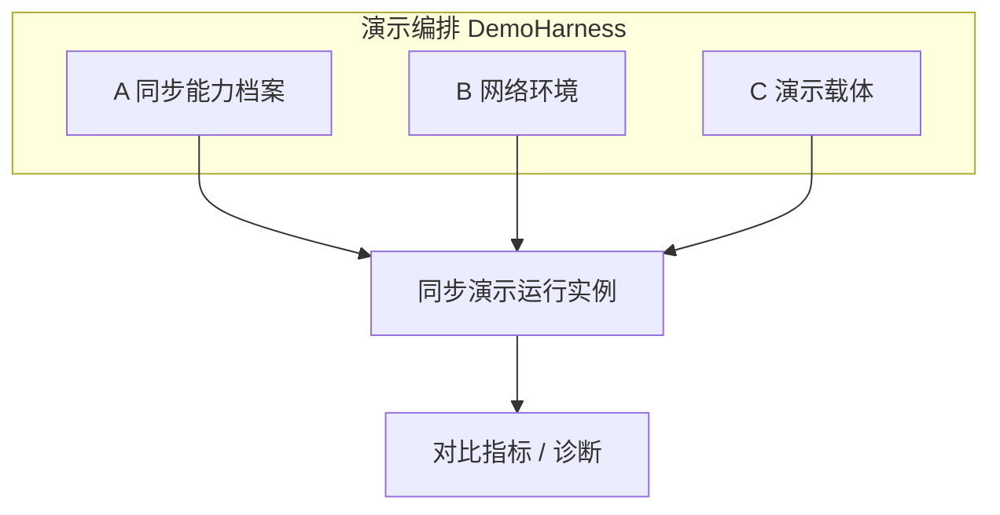
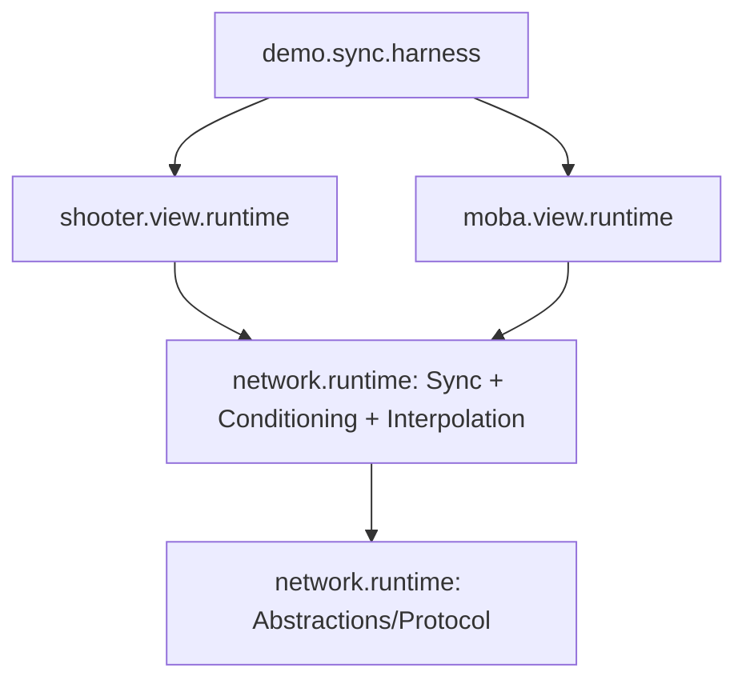
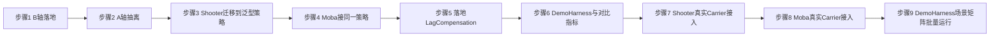

# 同步演示框架：示例层重构设计

> 阅读对象：网络同步框架的维护者
>
> 文档目标：把当前以 Shooter 为单一载体的示例层，重构为一个可演示多种同步能力档案、可注入网络环境、可承载多种玩法的「同步演示框架」。明确三轴正交模型、各轴契约草案与迁移步骤。

---

## 1. 背景与问题

当前 Shooter 示例已经落地两种生产级同步模式（PredictRollback、AuthoritativeInterpolation），且 Moba 已复用框架的 `RemoteInterpolationPlayback<TSample>` 验证了「通用同步能力下沉框架、玩法只留 Sample/Projector」的可行性。

但目标是把示例层做成一个**同步演示框架**：

- 演示多种同步能力档案（含后续守望先锋式混合同步、服务器回溯延迟补偿等）
- 可注入发送/接收延迟、抖动、丢包、乱序等网络环境，强化验证
- 让能力组合之间在恶劣网络下的差异可被直观对比

按这个目标审视现状，示例层的基础尚未打好。根因是**三件本应正交的事被焊在了一起**。

### 1.1 三件正交的事

- **A. 被演示的同步能力档案**：由客户端播放、输入、快照、兴趣管理、恢复、服务器判定等 policy 组成；`PredictRollback` / `AuthoritativeInterpolation` 可作为兼容档案名。
- **B. 网络环境**：延迟 / 抖动 / 丢包 / 乱序 / 带宽限制。
- **C. 演示载体**：Shooter（2D）/ Moba（3D）这类具体玩法世界 + 表现。

### 1.2 当前耦合点（基于代码）

1. **A 与 C 焊死**：[`IShooterClientSyncController`](Unity/Packages/com.abilitykit.demo.shooter.view.runtime/Runtime/Client/Synchronization/IShooterClientSyncController.cs:19) 同时承载「同步模式行为」（Tick/CatchUp/对账状态）与「Shooter 玩法契约」（`StartGame(in ShooterStartGamePayload)`、`SubmitLocalInput(in ShooterPlayerCommand)`、`ApplyGatewayPush`、各类 `ShooterClientReconciliationResult` / `ShooterClientResyncReason`）。新增一个模式必须在 Shooter 类型上重写一遍，无法被 Moba 复用。
2. **B 完全缺失**：框架已有 [`INetworkMiddleware`](Unity/Packages/com.abilitykit.network.runtime/Runtime/Network/Abstractions/INetworkMiddleware.cs:6)（`OnInbound` / `OnOutbound`）这一天然插点，但没有任何延迟/抖动/丢包中间件实现。当前无法制造可控的劣化网络。
3. **模式词汇表宽于实现**：[`NetworkSyncModel`](Unity/Packages/com.abilitykit.network.runtime/Runtime/Network/Runtime/NetworkSyncModel.cs:7) 定义了 8 种模式，工厂 [`ShooterClientSyncControllerFactory.Create`](Unity/Packages/com.abilitykit.demo.shooter.view.runtime/Runtime/Client/Synchronization/ShooterClientSyncControllerFactory.cs:37) 只实现 2 种，其余 `throw NotSupportedException`。

### 1.3 已具备的良好基础（不推翻）

- 模式选择已有单一入口：`ShooterClientSyncControllerFactory.Create(NetworkSyncModel, ...)`，session facade 对模式无感。
- 通用插值播放已在框架包，Shooter/Moba 共享，复用已验证。
- [`INetworkSyncController`](Unity/Packages/com.abilitykit.network.runtime/Runtime/Network/Runtime/INetworkSyncController.cs:10) 已是 gameplay-agnostic 的最小缝（`SyncModel` / `IsStarted` / `CurrentFrame`）。

**结论**：这是一次「解耦 + 补缺 + 收敛」，不是推倒重来。

---

## 2. 目标：三轴正交模型

让 A / B / C 各自成为可独立替换的轴，并让每个声明支持的组合都能被运行、诊断和报告。这里的正交不等于所有枚举项与所有载体天然有效；不支持的组合也应被明确报告为 unsupported / degraded / failed。



正交后的能力矩阵示意：

| 轴 | 可选项示例 | 归属层 |
|----|-----------|--------|
| A 能力档案 | PredictRollback / AuthoritativeInterpolation / HybridHeroPrediction / ServerRewindLagCompensation | 框架（能力档案 + 客户端策略 + 服务端能力）|
| B 环境 | 理想 / 局域网 / 4G / 跨国 / 弱网丢包 | 框架（中间件 + 预设）|
| C 载体 | Shooter 2D / Moba 3D | demo（Sample + Projector + 世界接入 + capability 声明）|

任一被声明支持的格子 = 一次可运行的演示。新增延迟补偿不再理解为一个可自动套到所有载体的 A 轴枚举，而是一个服务器侧判定能力；只有 carrier 和场景声明具备必要输入、历史帧和命中语义时，才应进入可运行矩阵。

---

## 3. B 轴：可注入网络环境（最高优先级）

理由：没有可控劣化网络，「演示不同模式的差异」与「延迟补偿」都无从谈起——模式间区别恰恰在恶劣网络下才显现。且该轴当前完全空白，是基础。

### 3.1 归属与插点

框架级、玩法无关，挂在 [`INetworkMiddleware`](Unity/Packages/com.abilitykit.network.runtime/Runtime/Network/Abstractions/INetworkMiddleware.cs:6) 上。建议新增目录 `network.runtime/Runtime/Network/Runtime/Conditioning/`。

### 3.2 契约草案

```csharp
namespace AbilityKit.Network.Runtime.Conditioning
{
    /// <summary>一组可复现的网络环境参数（玩法无关）。</summary>
    public readonly struct NetworkConditionProfile
    {
        public int BaseLatencyMs { get; }      // 单向基础延迟
        public int JitterMs { get; }           // 抖动幅度（±）
        public double PacketLossRate { get; }  // 0..1 丢包率
        public double ReorderRate { get; }     // 0..1 乱序率
        public int BandwidthKbps { get; }      // 0 表示不限带宽

        // 预设
        public static NetworkConditionProfile Ideal { get; }        // 0 延迟无损
        public static NetworkConditionProfile Lan { get; }          // ~5ms
        public static NetworkConditionProfile Mobile4G { get; }     // ~60ms + 抖动
        public static NetworkConditionProfile CrossRegion { get; }  // ~150ms
        public static NetworkConditionProfile PoorWifi { get; }     // 高抖动 + 丢包
    }

    /// <summary>
    /// 基于固定种子的可复现网络环境模拟。注入 seed 保证测试可重放。
    /// 内部以一个延迟队列对 inbound/outbound 包打时间戳、丢弃、乱序。
    /// </summary>
    public sealed class NetworkConditioningMiddleware : INetworkMiddleware
    {
        // clockMs 可注入虚拟时钟（默认 Environment.TickCount64），seed 固定随机源。
        public NetworkConditioningMiddleware(NetworkConditionProfile profile, Func<long>? clockMs = null, int seed = 0);
        public void OnInbound(...);   // 收包 → 计数 → 按 profile 调度入缓冲队列
        public void OnOutbound(...);  // 同理（发包方向）
        public void Advance(long nowMs); // 时间驱动：释放到期包，按到达时刻 + 乱序序号排序后 next()
        public NetworkConditioningStats GetStats(); // 收/发各自的 已收/已投递/已丢弃/已乱序 + 待投递计数
    }
}
```

要点：
- **确定性**：固定 `seed`，使「模式 × 环境」的对比可复现、可单测。
- **双向**：发送与接收延迟分别可配（用户明确提到「发送和接收延迟」）。
- **时间源可注入**：内部依赖一个可注入的时钟，单测里用虚拟时钟推进，无需真实 sleep。

### 3.3 最小验证

- 单测：给定 profile + seed，注入 N 个包，断言到达时刻、丢弃数、乱序序列与期望一致。
- 演示：把同一模式分别挂 `Ideal` 与 `PoorWifi`，对比远端实体抖动/回滚频率。

---

## 4. A 轴：同步能力契约从 Shooter 抽到框架

目标：把「客户端同步策略行为」从 `IShooterClientSyncController` 里剥出来，泛型化进框架，使通用客户端策略写一次即可被 Shooter/Moba 复用；同时避免把服务器快照发布、兴趣管理、恢复流程、延迟补偿都误塞进同一个客户端接口。

### 4.1 拆分原则

把现有 `IShooterClientSyncController` 一分为二：

- **框架层 · 模式行为契约**（玩法无关，泛型表达世界输入/快照样本）。
- **demo 层 · 玩法适配**（StartGame/SubmitInput/把模式输出投影到表现，绑 Shooter/Moba 具体类型）。

### 4.2 框架契约草案

```csharp
namespace AbilityKit.Network.Runtime.Sync
{
    /// <summary>
    /// 一个同步模式的客户端运行行为，玩法无关。
    /// TInput  = 本地输入命令（demo 定义）
    /// TSample = 远端权威样本（demo 定义，实现 IRemoteSnapshotSample）
    /// </summary>
    public interface IClientSyncStrategy<TInput, TSample> : INetworkSyncController
        where TSample : IRemoteSnapshotSample
    {
        // 推进本地模拟 / 远端播放
        SyncTickResult Tick(float deltaSeconds);

        // 提交本地输入（预测类模式会记历史用于重放）
        void SubmitInput(in TInput input);

        // 喂入一条已解码的远端权威样本
        void ObserveRemote(in TSample sample);

        // 追帧 / 对账诊断（统一的、玩法无关的结果）
        SyncReconciliationReport GetReconciliationReport();
    }

    /// <summary>模式无关的对账/追帧诊断，替代 Shooter 专属的一堆 LastResync* 字段。</summary>
    public readonly struct SyncReconciliationReport { /* frame, hashes, reason, recoveryState */ }
}
```

要点：
- `TInput` / `TSample` 泛型化，使 Shooter（2D 命令）与 Moba（3D 命令）共用同一模式实现。
- 原 Shooter 专属的 `LastResyncReason` / `RecoveryState` 等收敛为统一 `SyncReconciliationReport`。
- 「解码网络字节 → TSample」「TSample → 表现投影」仍留在 demo（沿用 Moba 已验证的 Sample/Projector 模式）。

### 4.3 demo 适配契约

```csharp
// demo 层：把玩法世界喂给模式策略，把策略输出投影到表现
public interface IShooterDemoAdapter
{
    bool StartGame(in ShooterStartGamePayload payload);
    ShooterClientInputSubmitResult SubmitLocalInput(in ShooterPlayerCommand command);
    ShooterSnapshotApplyResult ApplyGatewayPush(uint opCode, ArraySegment<byte> payload);
}
```

`IShooterClientSyncController` 退化为 `IClientSyncStrategy<ShooterPlayerCommand, ShooterRemoteSnapshotSample>` + `IShooterDemoAdapter` 的组合，原有 Shooter 行为保持不变（迁移期向后兼容）。

### 4.4 NetworkSyncModel 收敛

与本轴同步处理第 1.2.3 项：`NetworkSyncModel` 短期作为兼容入口和档案名保留，XML doc 应说明实现状态与抽象层级；中期新增 `NetworkSyncProfile` 或等价结构表达客户端播放、输入、快照、兴趣管理、恢复、服务器判定等 policy。`NetworkSyncModel` 不应继续被当作完整同步方案的唯一抽象。

---

## 5. C 轴：演示载体职责边界

C 轴只负责「玩法世界 + 表现 + 能力声明」，不实现通用 A/B 逻辑。

每个 demo 载体需提供：

1. **TInput 定义**（Shooter: `ShooterPlayerCommand`；Moba: 3D 命令）。
2. **TSample + Decoder**（网络字节 → 强类型样本，实现 `IRemoteSnapshotSample`）。
3. **Projector**（样本 → 表现），如 [`ShooterRemoteSnapshotProjector`](Unity/Packages/com.abilitykit.demo.shooter.view.runtime/Runtime/Client/Synchronization/ShooterRemoteSnapshotSample.cs:1) / `MobaRemoteSnapshotProjector`。
4. **世界接入端口**（推进权威/预测世界的 runtime port）。

C 轴**不**实现通用同步策略逻辑，也**不**关心网络环境的具体模拟方式。Shooter 与 Moba 都按此清单接入后，只能自动获得它们声明支持的「A 能力档案 × B 环境」演示能力；未声明或缺少玩法语义的组合应由 DemoHarness 报告为 unsupported，而不是静默假设可运行。

---

## 6. 目标包结构

```
com.abilitykit.network.runtime/ (框架)
  Network/Runtime/
    Conditioning/                ← B 轴：新增
      NetworkConditionProfile.cs
      NetworkConditioningMiddleware.cs
      NetworkConditioningStats.cs
    Sync/                        ← A 轴：新增（客户端策略契约 + 能力档案草案）
      IClientSyncStrategy.cs
      SyncReconciliationReport.cs
      PredictRollbackStrategy.cs        (从 Shooter 提炼)
      AuthoritativeInterpolationStrategy.cs (从 Shooter 提炼)
    Interpolation/               ← 已存在，不动
    NetworkSyncModel.cs          ← 兼容档案名 / 旧枚举入口

com.abilitykit.demo.shooter.view.runtime/ (C 载体)
  仅保留 TInput / TSample+Decoder / Projector / 世界接入 + demo 适配

com.abilitykit.demo.moba.view.runtime/ (C 载体)
  同上（已具备 Sample/Projector 雏形）

com.abilitykit.demo.sync.harness/ (可选，新增)
  DemoHarness：装配 A×B×C，产出对比指标
```

依赖方向（单向向下，沿用现有边界约定）：



---

## 7. 迁移步骤（按依赖顺序，向后兼容）



1. **步骤 1 · B 轴落地** ✅ 已完成：在 `network.runtime/Runtime/Network/Runtime/Conditioning` 实现 `NetworkConditionProfile`（含 Ideal/Lan/Mobile4G/CrossRegion/PoorWifi 预设）+ `NetworkConditioningMiddleware`（可注入时钟与 seed，`Advance(nowMs)` 时间驱动投递）+ `NetworkConditioningStats`。配套 6 项确定性单测（延迟到达时序、丢包计数、payload 拷贝隔离、乱序逆序、同 seed 可复现），全部通过。纯新增，未触碰现有代码。
2. **步骤 2 · A 轴抽离** 🚧 契约已落地：在 `network.runtime/Runtime/Network/Runtime/Sync` 新增 `IClientSyncStrategy<TInput,TSample>`（`: INetworkSyncController`，`where TSample : IRemoteSnapshotSample`，暴露 `Tick/SubmitInput/ObserveRemote/GetReconciliationReport`）+ 诊断契约 `SyncReconciliationReport`（含 `SyncReconciliationReason`/`SyncRecoveryState`/`SyncTickResult`，统一 Shooter 散落的 `Last*` 字段）；`NetworkSyncModel` 已逐项 XML 标注实现状态（PredictRollback/AuthoritativeInterpolation 已实现，其余「not implemented yet」预留）。按后续审计校准，`IClientSyncStrategy<TInput,TSample>` 是客户端策略接口，不代表完整同步方案；`NetworkSyncModel` 是兼容档案名，不应继续扩张为所有能力的互斥枚举。`AbilityKit.Network.Runtime` 构建 0 错误，纯新增未触碰现有代码。**待步骤 3**：把 PredictRollback / Interpolation 的客户端策略逻辑提炼为框架泛型实现，Shooter 现有类降为薄适配壳。
3. **步骤 3 · Shooter 迁移** 🚧 契约已绑定：`IShooterClientSyncController` 现额外继承框架 `IClientSyncStrategy<ShooterPlayerCommand,ShooterRemoteSnapshotSample>`；两个控制器（`ShooterClientPredictRollbackSyncController` / `ShooterClientAuthoritativeInterpolationSyncController`）以**显式接口实现**绑定框架契约（`Tick→SyncTickResult`、`SubmitInput`、`ObserveRemote`、`GetReconciliationReport`），公共 demo 表面不变。新增内部映射器 `ShooterClientSyncStrategyMapping`（`ShooterClientFrameTickResult→SyncTickResult`、`Last*` 字段 → `SyncReconciliationReport`）。`ObserveRemote` 语义按模式区分：PredictRollback 为空操作（经 `ApplyGatewayPush` 导入权威快照回滚对账），Interpolation 转发至 `_playback.Observe(sample)`。新增 2 项契约可达性测试，Shooter 全量 **99 项测试全部通过**（原 97 + 新增 2），纯新增向后兼容。**待步骤 3 收尾**：把两模式逻辑进一步提炼为框架泛型策略实现，Shooter 类降为薄适配壳。
4. **步骤 4 · Moba 接同一策略** 🚧 契约已绑定：Moba 同步层较 Shooter 精简（无既有控制器、无 PredictRollback，仅 AuthoritativeInterpolation），故采用**直接实现**而非显式接口实现——新增公共 `MobaClientAuthoritativeInterpolationSyncController` 直接实现框架 `IClientSyncStrategy<PlayerInputCommand,MobaRemoteSnapshotSample>`（`SyncModel=AuthoritativeInterpolation`、`SubmitInput` 空操作、`ObserveRemote` 转发 `_playback.Observe`、`GetReconciliationReport` 恒为 `None`），内部包装既有 `MobaRemoteInterpolationPlayback`。`TInput=PlayerInputCommand`（Moba 既有输入命令类型）、`TSample=MobaRemoteSnapshotSample`（既有 `IRemoteSnapshotSample`）。为 `MobaRemoteInterpolationPlayback` 增 `Observe(in MobaRemoteSnapshotSample)` 强类型接缝；`AbilityKit.Demo.Moba.View.Runtime.csproj` 补登记新文件 Compile 项 + `AbilityKit.World.FrameSync` 引用（Unity asmdef 已引用，无需改）。新增 2 项契约可达性测试，Moba 全量 **8 项测试全部通过**（原 6 + 新增 2），纯新增向后兼容。A 轴泛型化对第二载体生效已验证。
5. **步骤 5 · 落地 LagCompensation** ✅ 已完成：`NetworkSyncModel` 增 `ServerRewindLagCompensation = 8`，在 `network.runtime/Runtime/Network/Runtime/LagCompensation` 新增框架级 `ServerRewindLagCompensationService`，由服务器记录权威帧历史并按请求帧回溯到最近的历史快照，用 `LagCompensatedEntitySnapshot` 的球形 hitbox 做确定性 ray/sphere 命中验证；支持 `MaxHistoryFrames`、`MaxRewindFrames` 与 `HitRadiusPadding`，覆盖 history 裁剪、窗口越界拒绝、最近旧帧回溯、dead/self/layer 过滤以及 favor-the-shooter 近失命中容忍。新增 `AbilityKit.Network.Runtime.Tests` 工程并纳入解决方案，LagCompensation 7 项测试全部通过；Shooter 全量 99 项、Moba 全量 8 项回归全部通过。当前落点为玩法无关的服务器侧判定能力，后续 DemoHarness 可把它接入 B 轴高延迟环境做可视化对比。
6. **步骤 6 · DemoHarness** ✅ 已完成最小框架内核：在 `network.runtime/Runtime/Network/Runtime/DemoHarness` 新增 `DemoHarnessRunner`、`DemoHarnessScenario`、`ISyncDemoCarrier`、`DemoHarnessStepTelemetry` 与 `DemoHarnessMetrics`，以玩法无关方式装配 A（当前为 `NetworkSyncModel` 兼容档案名）× B（`NetworkConditionProfile`）× C（carrier 名称/适配器），并聚合 tick 推进、对账次数、全量快照请求、回放 tick、远端抖动、命中接受/拒绝与 `NetworkConditioningStats` 网络计数。新增单测覆盖成功聚合、carrier 不匹配、sync model 不匹配、非法 stepCount 与批量场景矩阵运行，`AbilityKit.Network.Runtime.Tests` 全量 **15 项测试全部通过**。当前落点为可测试的框架内核，已被 Shooter 与 Moba 两个真实 carrier 复用验证；后续应增加 carrier capability 声明，把 unsupported / degraded / failed 纳入矩阵结果，再推进场景编排与可视化对比面板。
7. **步骤 7 · Shooter 真实 Carrier 接入** ✅ 已完成首个真实 C 轴纵切：在 `shooter.view.runtime/Runtime/Client/Synchronization` 新增 `ShooterDemoHarnessCarrier`，以薄适配方式包装既有 `IClientSyncStrategy<ShooterPlayerCommand,ShooterRemoteSnapshotSample>`，不接管 Shooter 生命周期、不启动世界、不侵入玩法逻辑；由调用方先完成控制器/世界启动，Carrier 只向 `DemoHarnessRunner` 暴露 `CarrierName`、`SyncModel` 与单步 telemetry。Telemetry 聚合复用框架 `SyncTickResult`、`SyncReconciliationReport`、`NetworkConditioningStats`，远端抖动与命中接受/拒绝通过委托注入，避免把 Shooter 专有统计反灌进框架主契约。新增 2 项纵切测试覆盖真实 `ShooterClientPredictRollbackSyncController` 经 Harness 推进，以及网络/命中统计注入后被 `DemoHarnessMetrics` 聚合；Shooter 全量 **101 项测试全部通过**，Network Runtime 全量 **12 项测试全部通过**。
8. **步骤 8 · Moba 真实 Carrier 接入** ✅ 已完成第二个真实 C 轴纵切：在 `moba.view.runtime/Runtime/Game/Battle/Client/Synchronization` 新增 `MobaDemoHarnessCarrier`，以薄适配方式包装既有 `IClientSyncStrategy<PlayerInputCommand,MobaRemoteSnapshotSample>`，保持 Moba AuthoritativeInterpolation 控制器与远端插值播放逻辑不变；`AbilityKit.Demo.Moba.View.Runtime.csproj` 显式登记新文件编译项。Carrier 与 Shooter 保持同一遥测形态：`SyncTickResult`、`SyncReconciliationReport`、`NetworkConditioningStats` 直接进入 Harness，远端抖动和命中统计通过委托注入。新增 2 项纵切测试覆盖真实 `MobaClientAuthoritativeInterpolationSyncController` 经 Harness 推进，以及网络/命中统计注入后被 `DemoHarnessMetrics` 聚合；Moba View Runtime 全量 **10 项测试全部通过**，Network Runtime 全量 **12 项测试全部通过**。至此 DemoHarness 已不再是 Shooter 单点验证，而是完成两个载体的 A×B×C 共用路径验证。
9. **步骤 9 · DemoHarness 场景矩阵批量运行** ✅ 已完成框架级批量编排：`DemoHarnessRunner` 新增 `RunMany(IEnumerable<DemoHarnessScenario>, IEnumerable<ISyncDemoCarrier?>)`，按场景顺序逐项匹配 `CarrierName + SyncModel`，命中后复用既有单场景 `Run`，缺失 carrier 时产出失败 `DemoHarnessRunResult` 但不中断后续场景；新增 `DemoHarnessBatchResult` 汇总 `Results`、`ScenarioCount`、`CompletedCount`、`FailedCount` 与 `AllCompleted`，作为后续 UI/报告层做 A×B×C 对比表的稳定数据结构。新增 3 项单测覆盖多场景多 carrier、缺失 carrier 失败隔离、空入参拒绝；Network Runtime 全量 **15 项测试全部通过**，Moba View Runtime 全量 **10 项测试全部通过**，Shooter Runtime 回归单独重跑 **101 项测试全部通过**。

每步独立可验证、可单独合入；前序步骤不依赖后序，任何一步停下都不破坏现有功能。

---

## 8. 风险与收敛

- **泛型契约过度设计**：`IClientSyncStrategy<TInput,TSample>` 只暴露当前两种客户端策略确实共用的方法；新能力若需要额外表面，用小接口扩展，不膨胀主契约。该接口应定位为客户端同步策略，不代表完整同步方案。
- **同步模型层级混杂**：`NetworkSyncModel` 当前同时包含客户端播放、快照发布、兴趣管理、恢复流程和服务器判定能力。后续应按《网络同步抽象审计与能力矩阵》收敛为能力档案，避免把可组合能力误建模成互斥枚举；`NetworkSyncProfile`、policy enum 与兼容迁移草案见《网络同步能力档案与DemoHarness矩阵设计》。
- **三轴正交边界**：A/B/C 是演示组织方式，不代表所有组合天然有效。DemoHarness 后续应验证 carrier 声明的能力矩阵，并把 unsupported / degraded / failed 作为一等结果；下一轮实现应优先落 carrier capability 与 run status，而不是继续增加新场景枚举。
- **迁移期双轨**：步骤 2-3 期间框架策略与 Shooter 旧实现并存，以测试通过为切换闸门，避免一次性大改。
- **B 轴真实性边界**：中间件模拟的是「可复现的统计特征」，非真实物理链路；用于模式对比与回归足够，不替代真机弱网测试，文档需注明。

---

## 9. 结论

把示例层升级为同步演示框架的关键是让 A（模式/能力档案）/ B（环境）/ C（载体）尽量正交，但正交应理解为「能力声明后可组合、可验证、可报告缺口」，不是所有枚举项与所有载体自动成立。推进顺序固定为 **先 B 后 A 再具体模式**：

- 先补 B（框架级网络环境模拟），让差异可被制造与观测；
- 再把 A 从 Shooter 抽到框架并泛型化，同时按能力矩阵拆清客户端播放、输入、快照、兴趣管理、恢复和服务器判定；
- 最后具体模式（延迟补偿、批量快照、AOI、快速重连等）作为可组合能力逐个落地。

顺序不可逆：没有可控劣化网络，模式演示无对比意义；模式不解耦，每加一个都要重写一遍载体。该方案是解耦 + 补缺 + 收敛，复用现有的工厂入口、插值框架与 `INetworkMiddleware` 插点，不推翻已验证的基础。抽象层的详细校准以《网络同步抽象审计与能力矩阵》为准，下一轮可执行迁移以《网络同步能力档案与DemoHarness矩阵设计》为准。
