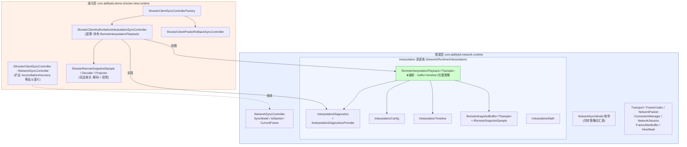
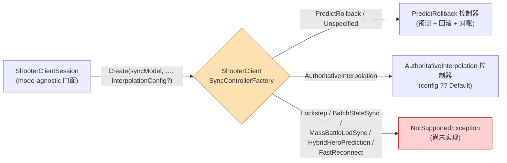
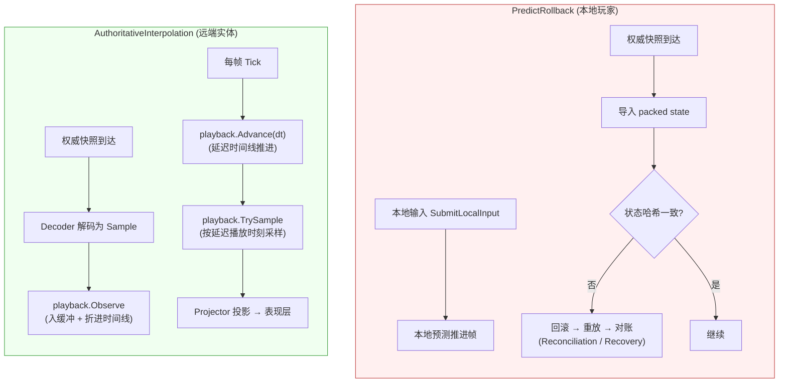
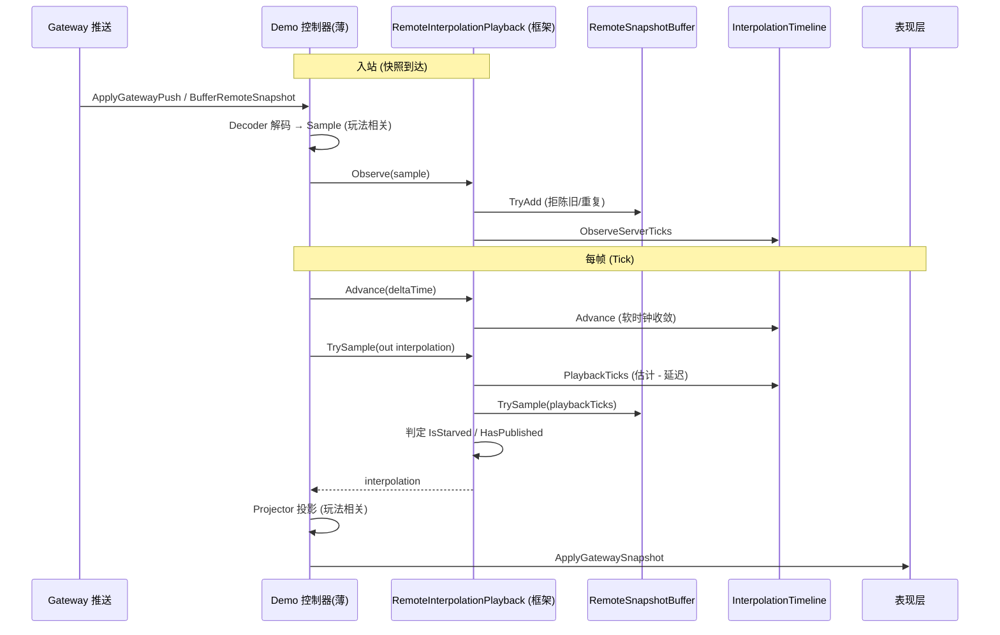

# 网络同步框架阶段性设计

> 本文沉淀 AbilityKit 网络同步框架当前阶段的设计与现状，配流程图。配套实现记录见《Shooter网络同步框架演示工程设计》Stage 3.5–3.8；抽象层最终口径以《网络同步抽象审计与能力矩阵》为准。
>
> 抽象校准：`NetworkSyncModel` 当前仍是兼容入口和模式词汇表，但后续不应继续把客户端播放、快照发布、兴趣管理、恢复流程和服务器判定都塞进单一枚举。能力维度与迁移建议见《网络同步抽象审计与能力矩阵》。

## 1. 设计原则

网络同步框架与演示工程严格分层，核心原则只有一句：

> **通用同步能力全部沉淀在框架包 `com.abilitykit.network.runtime`；Shooter / Moba 等只是演示工程，仅保留"解码样本 + 投影到表现 + 选择同步能力档案"这类与各自玩法强绑定的薄实现。**

任何与具体玩法零耦合的件（缓冲、时钟、插值数学、配置、诊断量、播放编排）都不允许沉淀在 demo 包里，否则每个接同步能力的 demo 都得重抄一遍。

## 2. 整体分层

- 框架层对外只暴露一个与玩法无关的同步接口 `INetworkSyncController`（`SyncModel` / `IsStarted` / `CurrentFrame`）。
- 演示层用 `IShooterClientSyncController : INetworkSyncController` 扩出 Shooter 特有的战斗语义（对账、强同步恢复、输入提交等），让 `ShooterClientSession` 门面保持 mode-agnostic。
- 插值原语族同处 `Network/Runtime/Interpolation` 一层：`InterpolationMath`、`RemoteSnapshotBuffer<TSample>`、`InterpolationTimeline` 是底层件，`InterpolationConfig` / `InterpolationDiagnostics` 是调参与可观测量，`RemoteInterpolationPlayback<TSample>` 把前述件串成一套可直接复用的编排。

## 3. 同步档案选择（工厂分发）

- 工厂是 demo 选择兼容同步档案的入口；新增客户端策略在此插入，不动 session 门面。中长期不应把所有服务端能力都塞进该工厂。
- `InterpolationConfig?` 走可选重载贯通：旧签名委托新签名并传 `null`，非插值模式忽略它，插值模式以 `InterpolationConfig.Default` 兜底——既有调用零改动。
- `NetworkSyncModel` 枚举目前定义了 8 个值（`Unspecified` / `Lockstep` / `PredictRollback` / `AuthoritativeInterpolation` / `BatchStateSync` / `MassBattleLodSync` / `HybridHeroPrediction` / `FastReconnect`），但工厂只实现了 `PredictRollback` 与 `AuthoritativeInterpolation`，其余抛 `NotSupportedException`。即"模式词汇表"宽于实际实现，属有意预留。
- 后续收敛方向是把 `NetworkSyncModel` 降级为兼容档案名：`PredictRollback` / `AuthoritativeInterpolation` 是客户端播放/对账策略，`BatchStateSync` 是快照发布策略，`MassBattleLodSync` 是兴趣管理与带宽策略，`FastReconnect` 是恢复流程，`ServerRewindLagCompensation` 是服务器判定能力；这些能力可组合，不应长期作为互斥枚举项理解。

## 4. 两条同步链路对比

关键差异：

- **PredictRollback** 纠正本地模拟：本地预测先行，权威快照到达后比对状态哈希，不一致就回滚→重放→对账（Shooter 还有漂移检测与强同步恢复，见专文）。
- **AuthoritativeInterpolation** 不碰本地模拟：远端实体快照按服务器 tick 缓冲，落后固定延迟平滑播放；播放时刻越过最新样本超过 `MaxExtrapolationTicks` 时置 `IsStarved` 标志而**不外推**（不臆造未授权运动，只保持最后权威姿态）。

## 5. RemoteInterpolationPlayback 抽离边界

`RemoteInterpolationPlayback<TSample>` 把"缓冲 + 时钟 + 延迟播放 + 采样 + 饥饿判定 + 诊断量"整套编排收进框架，demo 控制器只剩两个玩法回调式职责：**解码**推送为 `TSample`、把采样结果**投影并应用**到表现层。

框架 `RemoteInterpolationPlayback<TSample>` 暴露面：

| 成员 | 职责 |
|------|------|
| `Observe(TSample)` | 入缓冲 + 把样本 `TimelineTicks` 折进时间线；陈旧/重复样本被拒且不推进时钟 |
| `Advance(deltaSeconds)` | 推进延迟播放时间线（支持软时钟收敛） |
| `TrySample(out RemoteSnapshotInterpolation<TSample>)` | 在当前延迟播放时刻采样，更新 `IsStarved` / `HasPublished` |
| `GetDiagnostics()` | 产出框架层 `InterpolationDiagnostics` |
| `BufferedSampleCount` / `PlaybackTicks` / `EstimatedServerTicks` / `IsStarved` / `HasPublished` | 只读运行态 |
| `Reset()` | 清空缓冲、时间线与标志 |

demo 控制器（如 `ShooterClientAuthoritativeInterpolationSyncController`）退薄后：持有一个 `RemoteInterpolationPlayback<ShooterRemoteSnapshotSample>`，`Tick` 里 `Advance` + `TrySample`→`Project`→`ApplyGatewaySnapshot`，`BufferRemoteSnapshot` 仅 `Observe`，诊断量全部只读转发；自身不再持有 buffer/timeline/外推阈值字段，对外公开契约不变。

## 6. 现状与方向

已落地的两种生产级客户端能力：

- **PredictRollback**：本地预测 + 权威回滚 + 对账，含漂移检测与强同步恢复。
- **AuthoritativeInterpolation**：远端实体延迟插值播放，配置 / 诊断 / 编排全部下沉框架层。

测试现状：Shooter 91 项 + Moba `AbilityKit.Demo.Moba.View.Runtime.Tests` 6 项 = 97 项全部通过、0 失败（Shooter 85 接入/控制器基线 + 6 项 `RemoteInterpolationPlayback` 框架级单测；Moba 6 项复用链路单测）。

已落地的复用验证：

1. **Moba 复用链路**：Moba 已通过 `MobaRemoteSnapshotSample` / `MobaRemoteSnapshotProjector` / `MobaRemoteInterpolationPlayback` 真正复用框架的 `RemoteInterpolationPlayback<MobaRemoteSnapshotSample>`。Moba 仅提供自己的 3D Sample（X/Y/Z + 平面速度）与投影器，缓冲 / 时间轴 / 外推 / 饥饿策略全部沿用框架层，验证了抽离的复用价值。

仍待推进：
2. **能力档案与支持矩阵**：`NetworkSyncModel` 宽于实现且混合了不同抽象层级，后续不应按枚举项逐个硬落地。优先设计 `NetworkSyncProfile` 或等价能力档案，并让 Shooter / Moba / DemoHarness 声明支持矩阵；`HybridHeroPrediction` 这类组合应由多个 policy 组成，而不是和基础客户端策略平级。
