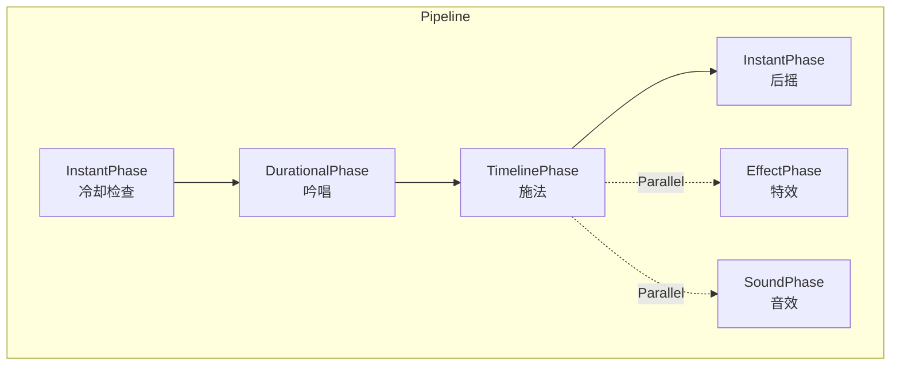
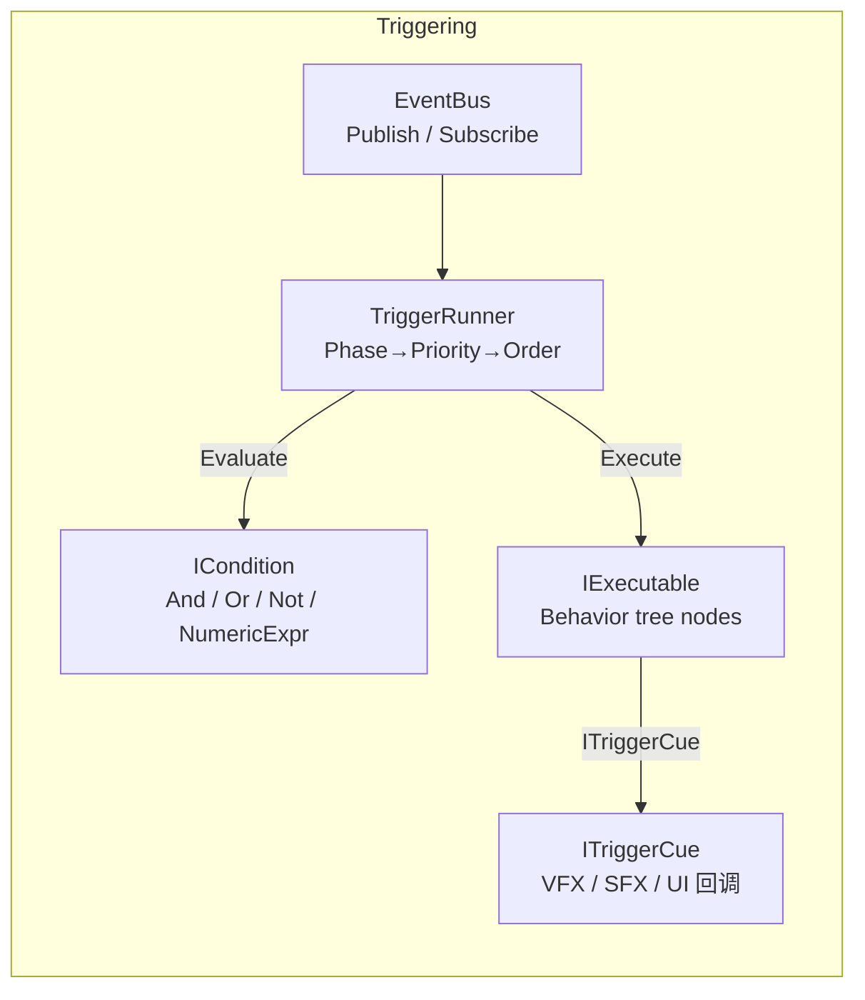
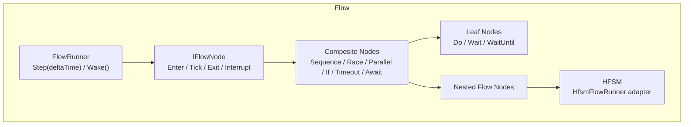
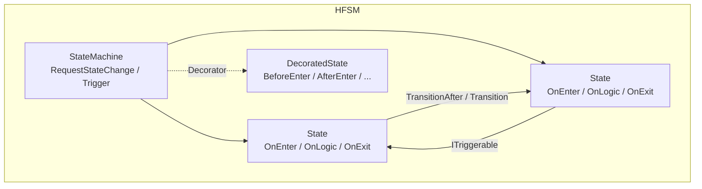

# Ability-Kit

> 通用游戏战斗工具集合源码 | Logic-Presentation Separation | Ability System | 按需组合

**Ability-Kit** 是一个基于 Unity UPM 的通用游戏战斗框架，专注于**技能系统、战斗逻辑**。框架采用模块化设计，提供数据驱动的技能编排、事件触发系统、流程引擎等核心能力，支持按需组合以适配不同类型的游戏（MOBA、MMO、ARPG、RTS 等）。核心战斗逻辑以纯 C# runtime 形式实现，可脱离 Unity 环境运行（例如服务器/工具链/单元测试）；与 Unity 强相关的部分主要集中在表现层与少量适配层。

Ability-Kit 目前处于**开发期**。这个仓库保存的是 AbilityKit 相关模块包、示例工程、工具链和第三方适配的**完整源码集合**，方便统一开发、编译验证、示例演示和设计文档维护。

真实项目使用时不需要，也不建议把仓库内所有包一次性整体引入。更推荐按项目需求选择组合：

- 只做技能/触发：组合 `core`、`pipeline`、`triggering`、`ability` 等包。
- 只做逻辑流程：组合 `flow`、`hfsm`、`timer`、`context` 等包。
- 做帧同步/状态同步：组合 `world.framesync`、`world.snapshot`、`world.statesync`、`record`、`network` 等包。
- 做 Unity 表现和编辑器工具：按需加入 `unity.pool`、`base.editor`、`demo.moba.editor` 等包。
- 参考完整落地方式：阅读 `demo.moba.*` 最佳实践示例，但不要把示例包误认为所有项目的必选依赖。

---

## 仓库定位

这个仓库更接近一个“工具箱源码仓库”，而不是单一框架产品包。

| 目录 | 定位 |
|------|------|
| `Unity/Packages/` | Unity UPM 包源码。各 `com.abilitykit.*` 包是主要模块边界。 |
| `src/` | .NET 解决方案和样例工程，复用 `Unity/Packages/` 中的源码，用于纯 C# 编译、控制台运行和示例验证。 |
| `Server/` | 服务端、Orleans、网关等实验和集成代码。 |
| `Docs/` | 跨模块设计记录、规则说明和集成备忘。 |
| `LubanConfig/` | 配置表与生成相关素材。 |
| `tools/` | 本地开发、验证、smoke test 辅助脚本。 |

`Unity/Packages/` 中包目录较多，是因为这里集中存放了工具集合的全部源码，包括一个较完整的 MOBA 最佳实践示例。后续给其他项目使用时，应按需获取和组合，而不是默认全量使用。

---

## 当前状态

- 项目仍在开发期，部分包的 API、目录结构和依赖声明还会继续收敛。
- 许多模块已经具备独立包边界，但 `package.json`、`asmdef`、示例工程和服务端工程之间仍有一些历史依赖需要持续整理。
- `demo.moba` 是参考工程，用来展示框架组合方式、配置组织、协议同步、编辑器工具和运行时流程。
- 第三方包位于 `com.abilitykit.thirdparty.*`，主要作为源码/依赖承载，不建议直接放入 AbilityKit 业务扩展。

---

## 核心特性


| 特性          | 说明                                        |
| ----------- | ----------------------------------------- |
| **逻辑与表现分离** | 纯 C# 逻辑层可在服务器、客户端、编辑器环境下运行，通过事件与表现层解耦     |
| **帧同步确定性**  | 支持帧同步、回滚、客户端预测、断线重连，保证多人战斗的确定性            |
| **数据驱动**    | 技能、效果、触发器均可通过配置定义，配合可视化编辑器提升效率            |
| **高度可扩展**   | 模块化设计，支持 Hook/Feature/Blueprint 扩展机制，按需裁剪 |
| **高性能**     | 索引表查询、对象池、流式处理、零 GC 分配优化                  |


---

## 架构总览

```
┌─────────────────────────────────────────────────────────────────────────────┐
│                              Ability-Kit 框架                               │
├─────────────────────────────────────────────────────────────────────────────┤
│                                                                             │
│  ┌─────────────────────────────────────────────────────────────────────┐   │
│  │                          游戏应用层                                   │   │
│  │   ┌──────────────┐  ┌──────────────┐  ┌──────────────┐             │   │
│  │   │   技能系统   │  │   战斗系统   │  │   录像回放   │             │   │
│  │   │  (Pipeline) │  │  (Combat)   │  │  (Record)   │             │   │
│  │   └──────────────┘  └──────────────┘  └──────────────┘             │   │
│  └─────────────────────────────────────────────────────────────────────┘   │
│                                    │                                        │
│  ┌─────────────────────────────────────────────────────────────────────┐   │
│  │                          引擎层                                       │   │
│  │   ┌──────────────┐  ┌──────────────┐  ┌──────────────┐             │   │
│  │   │   流程引擎   │  │   触发系统   │  │   状态机     │             │   │
│  │   │    (Flow)    │  │ (Triggering) │  │   (HFSM)     │             │   │
│  │   └──────────────┘  └──────────────┘  └──────────────┘             │   │
│  └─────────────────────────────────────────────────────────────────────┘   │
│                                    │                                        │
│  ┌─────────────────────────────────────────────────────────────────────┐   │
│  │                          世界层                                       │   │
│  │   ┌──────────────┐  ┌──────────────┐  ┌──────────────┐             │   │
│  │   │   依赖注入   │  │    ECS      │  │   帧同步     │             │   │
│  │   │  (World.DI)  │  │ (World.ECS) │  │(FrameSync)  │             │   │
│  │   └──────────────┘  └──────────────┘  └──────────────┘             │   │
│  │   ┌──────────────┐  ┌──────────────┐  ┌──────────────┐             │   │
│  │   │  状态同步    │  │ 帧数据层     │  │ 战斗传输层   │             │   │
│  │   │(StateSync)  │  │(NetworkFrag)  │  │(Battle.Trans)│             │   │
│  │   └──────────────┘  └──────────────┘  └──────────────┘             │   │
│  └─────────────────────────────────────────────────────────────────────┘   │
│                                    │                                        │
│  ┌─────────────────────────────────────────────────────────────────────┐   │
│  │                          核心层                                       │   │
│  │   ┌──────────────┐  ┌──────────────┐  ┌──────────────┐             │   │
│  │   │   数学库     │  │   属性系统   │  │   效果系统   │             │   │
│  │   │    (Math)    │  │(Attributes) │  │  (Effects)   │             │   │
│  │   └──────────────┘  └──────────────┘  └──────────────┘             │   │
│  └─────────────────────────────────────────────────────────────────────┘   │
│                                                                             │
└─────────────────────────────────────────────────────────────────────────────┘
```

---

## 模块速览

### 核心基础设施


| 模块                          | 说明                                                          |
| --------------------------- | ----------------------------------------------------------- |
| `com.abilitykit.core`       | 数学库（Vec2/Vec3/Quat/Transform3）、对象池、日志、事件系统、GameplayTag、数值系统 |
| `com.abilitykit.attributes` | 属性系统，支持 Buff/Debuff、自定义公式、脏标记优化                             |
| `com.abilitykit.effects`    | 效果系统核心：EffectScope、EffectInstance、EffectRegistry            |


### 世界管理层


| 模块                                      | 说明                                                       |
| --------------------------------------- | -------------------------------------------------------- |
| `com.abilitykit.world.di`               | 依赖注入容器，支持 Singleton/Scoped/Transient 三种生命周期              |
| `com.abilitykit.world.ecs`              | 轻量级 ECS 框架：Entity、EntityWorld、ComponentTypeId            |
| `com.abilitykit.world.framesync`        | 帧同步：FrameSync、Rollback、ClientPrediction、输入历史             |
| `com.abilitykit.world.snapshot`         | 快照路由：按 opCode 解码并分发到处理器（与网络解耦）                           |
| `com.abilitykit.world.networkfragments` | 帧数据包：FramePacket、RemoteFrameBuffer、RemoteFrameAggregator |
| `com.abilitykit.world.statesync`        | 状态同步与客户端预测：Rollback、Per-Entity/ECSPrediction、StateHash   |
| `com.abilitykit.record`                 | 录像回放：Session、Container、Track，支持输入录制、状态哈希采样               |


### 技能与战斗层


| 模块                               | 说明                                                                           |
| -------------------------------- | ---------------------------------------------------------------------------- |
| `com.abilitykit.pipeline`        | **技能管线编排**：Phase 阶段模型（Sequence/Parallel/Conditional/Delay/Repeat），支持中断/暂停/恢复 |
| `com.abilitykit.triggering`      | **事件触发引擎**：强类型事件驱动 + ExecCtx 依赖注入 + MarkerAttribute 自动注册                     |
| `com.abilitykit.ability.runtime` | 技能运行时：Ability、Effect、Triggering、EffectSource                                 |
| `com.abilitykit.ability.explain` | 技能解释/调试框架：Forest、Tree + Navigation Protocol                                  |
| `com.abilitykit.motion`          | 移动系统：MotionPipeline、来源组合、碰撞求解                                                |


| 模块                                    | 说明                          |
| ------------------------------------- | --------------------------- |
| `com.abilitykit.combat.entitymanager` | 实体管理器：索引表实现高效查询             |
| `com.abilitykit.combat.skilllibrary`  | 技能库：索引表实现高效技能查询             |
| `com.abilitykit.combat.targeting`     | 目标查找：查找目标、筛选、排序、流式处理、零 GC   |
| `com.abilitykit.combat.projectile`    | 投射物系统：对象池、帧同步、命中策略、范围效果     |
| `com.abilitykit.combat.damage`        | 伤害系统：DamagePipeline、自定义伤害公式 |


### 运行时与流程层


| 模块                              | 说明                                                                                                 |
| ------------------------------- | -------------------------------------------------------------------------------------------------- |
| `com.abilitykit.host`           | 服务器端抽象：World 管理、客户端连接、消息广播                                                                         |
| `com.abilitykit.host.extension` | Host 扩展：Session（FramePacketNetAdapter）、FrameSync、Rollback、Hook、Feature、Blueprint                   |
| `com.abilitykit.flow`           | **流程编排引擎**：IFlowNode 节点树（Sequence/Race/Parallel/If/Timeout/Await），FlowContext 作用域注入，WAKE/PUMP 事件驱动 |
| `com.abilitykit.hfsm`           | **分层状态机**：基于 UnityHFSM，ITriggerable 事件转换、IAction 行为层（BehaviorStatus）、Decorator AOP 包装              |


### 战斗传输层


| 模块                                             | 说明                                                           |
| ---------------------------------------------- | ------------------------------------------------------------ |
| `com.abilitykit.game.battle.runtime`           | 战斗逻辑传输接口：IBattleLogicTransport、请求/响应类型                       |
| `com.abilitykit.game.battle.transport.runtime` | 传输层实现：NetworkTransport、StateSyncAdapter（Moba）、INetworkClient |


### 网络层


| 模块                                   | 说明               |
| ------------------------------------ | ---------------- |
| `com.abilitykit.network.runtime`     | 网络运行时抽象          |
| `com.abilitykit.protocol`            | 协议定义：客户端/服务器共享协议 |
| `com.abilitykit.protocol.moba`       | MOBA 协议定义        |
| `com.abilitykit.protocol.memorypack` | MemoryPack 序列化实现 |


---

## 核心模块设计理念

### Pipeline（技能管线）

Pipeline 回答"技能应该经历哪些执行步骤"。每个技能被建模为一个 Phase（阶段）序列，支持中断（Interrupt）、暂停（Pause）和恢复（Resume）。




**核心抽象**：`IAbilityPipelinePhase<TCtx>` — 阶段需实现 `Execute()`、`OnUpdate(dt)`、`IsComplete`、`ShouldExecute()`、`Reset()`。Composite 阶段（Sequence、Parallel、Conditional）持有子阶段列表，按需嵌套。Pipeline 不直接依赖 Triggering，两者通过"Pipeline 编排技能阶段、Triggering 处理阶段内事件"的协作模式配合。

**适用场景**：技能施放流程（冷却→吟唱→施法→后摇）、Buff 持续效果、连招系统。

---

### Triggering（触发器系统）

Triggering 回答"当战斗事件发生时，应该执行哪些规则"。强类型事件驱动，触发器按 Phase→Priority→Order 三级排序。




**ExecCtx**：执行上下文结构体，通过依赖注入向所有 Evaluate/Execute 调用传递 `EventBus`、`FunctionRegistry`、`ActionRegistry`、`BlackboardResolver`、`NumericDomains`、`ExecutionControl`。**Marker 注册**：`[ExecutableTypeId]` 和 `[ConditionTypeId]` 属性标记类型，通过 `MarkerScanner<T>` 自动扫描程序集并注册到 `ExecutableRegistry`，零侵入扩展。**确定性保证**：`ExecPolicy.RequireDeterministic` 模式在注册时拒绝非确定性函数，确保帧同步回放安全。

**适用场景**：伤害事件触发 Buff、属性变化监听、被动技能生效、条件化战斗规则。

---

### Flow（流程引擎）

Flow 回答"如何组织异步/时间驱动的复杂逻辑"。基于 IFlowNode 节点树，支持事件驱动的 WAKE/PUMP 机制。




**核心特性**：FlowContext 作为作用域 Type→object 字典，在节点树间传递数据（RAII 风格的 UsingResource）。WAKE/PUMP 机制让 Flow 节点可以等待外部信号（异步完成、事件）再继续执行。AwaitCompletionNode 支持外部 `FlowCompletion.Set()` 信号，RunUntilCompletionNode 在 Flow 内部调度异步任务。**与 HFSM 的集成**：`HfsmFlowRunner` 将 HFSM 作为 Flow 节点嵌入，使状态机可以被 Flow 的 Sequence/Parallel/Timeout 等组合器管理。

**适用场景**：异步技能演出序列、UI 动画编排、跨系统协调流程（等待多个异步操作全部完成）。

---

### HFSM（分层状态机）

HFSM 回答"实体的状态是什么，以及如何在不同状态间切换"。基于 UnityHFSM，提供 ITriggerable 事件驱动转换和 IAction 行为层。




**状态转换**：Transition 支持条件谓词（ShouldTransition） + BeforeTransition/AfterTransition 钩子。TransitionAfter 支持时间延迟转换（可选）。**Trigger 系统**：ITriggerable 接口让状态可以订阅事件并触发转换，实现事件驱动的状态切换（如"受到伤害时切换到受击状态"）。**Action 层**：IAction 接口返回 `BehaviorStatus { Running, Success, Failure }`，支持行为树风格的动作（与 HFSM 正交）。**Decorator 模式**：DecoratedState 包装器为状态提供 AOP 钩子（BeforeEnter/AfterEnter/BeforeExit/AfterExit），用于日志、统计、横切逻辑。

**适用场景**：NPC AI（巡逻→追击→攻击→撤退）、角色状态机（站立/移动/跳跃/受击）、Boss 阶段切换。

---

## src/ 源码结构

`src/` 包含多个 .NET SDK 项目，通过 `<Compile Include>` 引用 `Unity/Packages/` 中的唯一源码。同一套源码既用于 Unity 编译，也用于 `dotnet build` 纯 C# 测试。

### 编译模式


| 模式       | 说明                           | 示例项目                                         |
| -------- | ---------------------------- | -------------------------------------------- |
| **纯引用**  | 直接引用 Unity/Packages 源码，无本地覆盖 | AbilityKit.Core, AbilityKit.Host             |
| **局部覆盖** | 引用源码时排除某些文件，本地提供 .NET 专用实现   | AbilityKit.World.ECS (`Impl/EntityWorld.cs`) |
| **聚合入口** | 不含源码，仅引用其他项目作为依赖             | AbilityKit.Demo.Moba.Infrastructure          |


### 目录树

```
src/
├── AbilityKit.Core/                          # 数学库、日志、事件、GameplayTag、数值系统
├── AbilityKit.GameplayTags/                  # 标签系统
├── AbilityKit.Modifiers/                    # 属性修改器
├── AbilityKit.Diagnostics/                   # 诊断工具
├── AbilityKit.GameFramework/                # 游戏框架基础
│
├── AbilityKit.World.DI/                     # 依赖注入容器
├── AbilityKit.World.ECS/                    # ECS 框架（含 Impl/EntityWorld.cs）
├── AbilityKit.World.Entitas/                 # Entitas ECS 适配
├── AbilityKit.World.FrameSync/              # 帧同步运行时
├── AbilityKit.World.NetworkFragments/       # 帧数据包
├── AbilityKit.World.Snapshot/               # 快照路由
├── AbilityKit.World.StateSync/              # 状态同步与预测
│
├── AbilityKit.Behavior/                     # Behavior 行为系统
├── AbilityKit.BTCore/                      # Behavior Tree 核心
├── AbilityKit.Context/                      # 上下文抽象
├── AbilityKit.Dataflow/                    # 数据流处理
├── AbilityKit.Threading/                    # 线程抽象
├── AbilityKit.Timer/                       # 定时器
├── AbilityKit.Trace/                       # 追踪系统
│
├── AbilityKit.Pipeline/                     # 技能管线编排
├── AbilityKit.Triggering/                   # 事件触发引擎
├── AbilityKit.Triggering.Abstractions/       # 触发器抽象
├── AbilityKit.Ability/                     # 技能系统聚合入口（引用多个子项目）
├── AbilityKit.Ability.Config/              # 技能配置数据模型
├── AbilityKit.Ability.Explain/             # 技能解释框架
│
├── AbilityKit.Flow/                        # 流程引擎
├── AbilityKit.HFSM.Core/                   # 分层状态机
├── AbilityKit.ActionSchema/               # 时序数据格式（DTO + TimelinePlayer）
│
├── AbilityKit.Host/                         # 服务器端抽象
├── AbilityKit.HotReload/                  # 热重载支持
├── AbilityKit.Record/                      # 录像系统
├── AbilityKit.Record.MemoryPack/           # MemoryPack 序列化
│
├── AbilityKit.Network.Runtime/              # 网络运行时
├── AbilityKit.Protocol/                     # 协议定义
├── AbilityKit.Protocol.Moba/               # MOBA 协议
│
├── AbilityKit.Combat.EntityManager/         # 实体管理器
├── AbilityKit.Combat.SkillLibrary/         # 技能库
├── AbilityKit.Combat.Targeting/            # 目标查找
├── AbilityKit.Combat.Motion/               # 移动系统
├── AbilityKit.Combat.Projectile/           # 投射物
├── AbilityKit.Combat.Damage/              # 伤害系统
├── AbilityKit.Combat.Collision.Abstractions/ # 碰撞抽象
├── AbilityKit.Combat.Collision.Unity/      # Unity 碰撞实现
│
├── AbilityKit.Game.Battle.Runtime/          # 战斗传输接口
├── AbilityKit.Game.Battle.Transport.Runtime/ # 传输层实现
│
├── AbilityKit.Samples/                      # 示例聚合入口
├── AbilityKit.Samples.Abstractions/         # 示例抽象
├── AbilityKit.Samples.Logic/                # 示例逻辑代码
├── AbilityKit.Demo.Moba.Core/              # MOBA 示例核心
├── AbilityKit.Demo.Moba.Infrastructure/    # MOBA 示例基础设施
├── AbilityKit.Demo.Moba.Console/           # MOBA Console Demo（可执行）
│
├── AbilityKit.CodeGen/                     # 代码生成器
├── AbilityKit.Analyzer/                    # Roslyn 分析器
├── AbilityKit.ThirdParty.Luban.Runtime/    # Luban 配置热更
```

---

## 快速开始

### 环境要求

- Unity 2022.3 LTS 或更高版本
- .NET SDK 6.0+（用于 `src/` 目录下的纯 C# 开发）

### 安装

1.  按需选择所需的包进行复制即可，暂时没拆分对应的package url（参见各模块的 README）

### 运行 Console Demo

```powershell
cd src/AbilityKit.Demo.Moba.Console
dotnet run
```

### 触发器与流程

| 模块 | 核心概念 | 入口 |
|---|---|---|
| **Triggering** | EventBus + TriggerRunner，按 phase/priority 调度触发器 | `com.abilitykit.triggering/Samples/` |
| **Flow** | FlowSession + IFlowNode，支持异步/时间驱动的流程编排 | `com.abilitykit.flow/Samples~/` |

> 完整示例代码见各模块 `Samples/` 目录，包含 TriggerPlan、DSL 写法、Flow 组合等参考实现。

---

## 文档导航

详细设计文档位于各模块的 `Document/` 目录下：


| 模块                                                                                                | 文档                                         |
| ------------------------------------------------------------------------------------------------- | ------------------------------------------ |
| [技术选型](./Unity/Packages/技术选型文档.md)                                                                | 从零开发战斗框架的技术选型                              |
| [Host 模块](./Unity/Packages/com.abilitykit.host.extension/Document/)                               | 游戏服务器运行时框架                                 |
| [状态同步与预测](./Unity/Packages/com.abilitykit.world.statesync/Document/StateSyncDesign.md)            | 客户端预测、Rollback、StateHash 校验                |
| [快照路由](./Unity/Packages/com.abilitykit.world.snapshot/Document/SnapshotRoutingBoundary.md)        | 快照路由与解码层边界                                 |
| [帧数据层](./Unity/Packages/com.abilitykit.world.networkfragments/Document/NetworkFragmentsDesign.md) | FramePacket、RemoteFrameBuffer 帧数据结构        |
| [World DI](./Unity/Packages/com.abilitykit.world.di/Document/)                                    | 依赖注入与组合系统                                  |
| [Flow 模块](./Unity/Packages/com.abilitykit.flow/)                                                  | 流程编排引擎（参考 Samples~/FlowExamples/README.md） |
| [Pipeline](./Unity/Packages/com.abilitykit.pipeline/Document/)                                    | 技能管线编排                                     |
| [Triggering](./Unity/Packages/com.abilitykit.triggering/Document/)                                | 事件触发器系统                                    |
| [帧同步](./Unity/Packages/com.abilitykit.world.framesync/Document/)                                  | 帧同步与回滚                                     |
| [Targeting](./Unity/Packages/com.abilitykit.combat.targeting/Document/)                           | 目标查找框架                                     |
| [Projectile](./Unity/Packages/com.abilitykit.combat.projectile/Document/)                         | 投射物系统                                      |
| [战斗传输层](./Unity/Packages/com.abilitykit.game.battle.runtime/Document/BattleTransportDesign.md)    | 战斗传输层架构、NetworkTransport                   |


---

## 网络同步架构

### 分层模型

```
┌────────────────────────────────────────────────────┐
│                  游戏应用层                         │
│         (MOBAGame、FPSTest、RPGDemo)               │
├────────────────────────────────────────────────────┤
│                  战斗传输层                         │
│  IBattleLogicTransport ← NetworkTransport           │
│                  (game.battle)                     │
├────────────────────────────────────────────────────┤
│               状态同步与客户端预测                   │
│  IClientPredictionModule / IPredictionCoordinator  │
│                  (world.statesync)                 │
├──────────────────────┬─────────────────────────────┤
│        帧数据层       │         快照路由层          │
│  FramePacket、Buffer │  FrameSnapshotDispatcher     │
│   (networkfragments) │         (world.snapshot)    │
├──────────────────────┴─────────────────────────────┤
│                  Host / Session                    │
│           FramePacketNetAdapter                    │
│              (host.extension)                     │
├────────────────────────────────────────────────────┤
│                  网络层                            │
│          INetworkClient、Orleans                   │
│             (network.runtime)                     │
└────────────────────────────────────────────────────┘
```

### 两种同步风格


| 风格                  | 推荐游戏            | 特点                     |
| ------------------- | --------------- | ---------------------- |
| **帧同步（FrameSync）**  | MOBA、格斗、RTS     | 服务器统一驱动，每帧输入同步，客户端本地计算 |
| **状态同步（StateSync）** | MMORPG、大型多人、FPS | 服务器权威，客户端接收快照，可选预测回滚   |
| **混合同步（Hybrid）**    | FPS+技能          | 移动帧同步，伤害状态同步           |


---

## License

MIT License