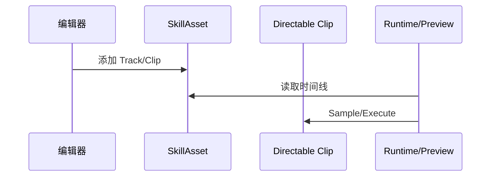

# Ability-Kit ActionEditorImpl 动作编辑器运行实现模块开发设计文档

> **阅读对象**：需要理解动作编辑器产物、Directable 轨道和 SkillAsset 运行时模型的开发者。
>
> **文档目标**：说明该包如何提供动作编辑器的运行时实现和轨道/片段类型。

---

## 一、设计理念

ActionEditorImpl 包提供动作编辑器使用的运行时资产和 Directables 类型。它包含技能资产、轨道、片段和参数模型，使编辑器中的时间线配置可以落到可序列化、可预览、可运行的对象上。

---

## 二、模块边界

负责：

- 定义 `SkillAsset`。
- 定义 Action/Animation/Audio/Effect/Signal 等轨道。
- 定义 PlayAnimation、PlayAudio、PlayParticle、MoveTo、MoveBy、RotateTo、ScaleTo、VisibleTo、TriggerEvent 等片段。
- 定义片段可用参数 `OptionParams`。

不负责：

- 不提供编辑器窗口主体。
- 不负责 Ability 业务逻辑解析。
- 不负责协议同步。

---

## 三、目录结构

| 路径 | 职责 |
|------|------|
| `Runtime/SkillAsset.cs` | 技能动作资产 |
| `Runtime/Directables/Tracks` | 时间线轨道类型 |
| `Runtime/Directables/Clips/Animation` | 动画片段 |
| `Runtime/Directables/Clips/Audio` | 音频片段 |
| `Runtime/Directables/Clips/Effect` | 特效片段 |
| `Runtime/Directables/Clips/Transform` | Transform 变化片段 |
| `Runtime/Directables/Clips/GameObject` | 显隐片段 |
| `Runtime/Directables/Clips/Event` | 事件触发片段 |

---

## 四、使用流程

编辑器创建 `SkillAsset`，向其中添加轨道和片段；预览器或运行时读取片段，在指定时间点采样并调用对应行为。

---

## 五、注意事项

- 该包是 ActionEditor 的运行数据实现，不应依赖 UnityEditor。
- Clip 类型新增后，需要同步预览器和实际执行器。
- 时间线 DTO 与 `actionschema` 的字段需要保持兼容。

---

*文档版本：1.0*  
*最后更新：2026-06-05*
