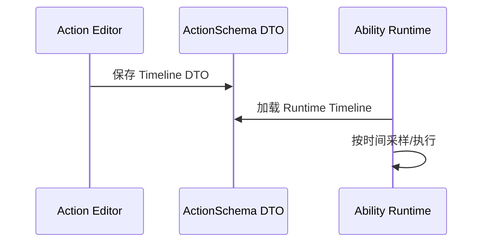

# Ability-Kit ActionSchema 动作时间线数据模块开发设计文档

> **阅读对象**：需要在运行时读取动作编辑器产出的时间线数据的开发者。
>
> **文档目标**：说明 ActionSchema 包作为共享 DTO/Runtime 数据层的边界。

---

## 一、设计理念

ActionSchema 包保存动作时间线的共享数据结构。它与编辑器实现分离，让运行时、服务器或工具可以读取同一份 timeline DTO，而不依赖 Unity 编辑器窗口。

---

## 二、模块边界

负责：

- 定义 ActionTimeline DTO。
- 定义运行时 timeline 数据结构。
- 提供 `com.abilitykit.actionschema.asmdef` 作为独立共享程序集。

不负责：

- 不提供编辑器 UI。
- 不执行 Timeline 行为。
- 不负责技能系统本身。
- 不负责序列化存储格式以外的业务校验。

---

## 三、目录结构

| 文件 | 职责 |
|------|------|
| `ActionTimelineDtos.cs` | 可序列化 DTO 定义 |
| `ActionTimelineRuntime.cs` | 运行时可消费的 timeline 模型 |
| `com.abilitykit.actionschema.asmdef` | 独立程序集定义 |

---

## 四、使用流程

---

## 五、注意事项

- DTO 字段变更会影响已保存配置，需考虑版本迁移。
- 该包应保持轻量，不应反向依赖 actioneditor 或 UnityEditor。
- 运行时执行逻辑应放在 Ability/ActionEditorImpl 或专门执行器中。

---

*文档版本：1.0*  
*最后更新：2026-06-05*
