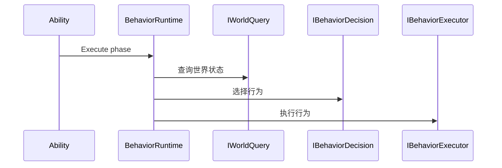

# Ability-Kit Behavior 行为执行模块开发设计文档

> **阅读对象**：需要把决策、查询和行为执行接入 Ability/World 的开发者。
>
> **文档目标**：说明 Behavior 包的接口层、执行器和运行时管理器职责。

---

## 一、设计理念

Behavior 模块提供轻量行为执行抽象。它不等同于完整行为树编辑器，而是把“世界查询、行为决策、行为执行”拆成接口，使 Ability 或 AI 模块可以用统一方式请求行为逻辑。

---

## 二、模块边界

负责：

- 定义 `IWorldQuery` 查询接口。
- 定义 `IBehaviorDecision` 决策接口。
- 定义 `IBehaviorExecutor` 和抽象基类 `ABehaviorExecutor`。
- 提供 `BehaviorManager`、`BehaviorRuntime` 运行时管理。
- 提供 `AbilityBehaviorPhase` 表达 Ability 行为阶段。

不负责：

- 不提供完整行为树图编辑。
- 不决定具体 AI 规则。
- 不直接操作 Unity 表现。

---

## 三、目录结构

| 路径 | 职责 |
|------|------|
| `Runtime/Core/BehaviorTypes.cs` | 行为相关枚举/类型 |
| `Runtime/Interface` | 查询、决策、执行接口 |
| `Runtime/Executor/ABehaviorExecutor.cs` | 行为执行器基类 |
| `Runtime/Runtime/BehaviorManager.cs` | 行为管理器 |
| `Runtime/Runtime/BehaviorRuntime.cs` | 行为运行时入口 |
| `Runtime/Pipeline/AbilityBehaviorPhase.cs` | Ability 行为阶段 |

---

## 四、典型流程

---

## 五、扩展点

- 实现 `IWorldQuery` 对接不同 World 数据源。
- 实现 `IBehaviorDecision` 封装 AI/技能规则。
- 继承 `ABehaviorExecutor` 实现具体行为。
- 在 Ability pipeline 中按 `AbilityBehaviorPhase` 接入。

---

*文档版本：1.0*  
*最后更新：2026-06-05*
