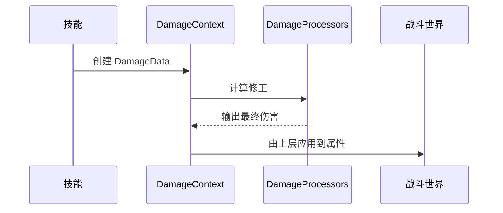

# Ability-Kit Combat Damage 伤害计算模块开发设计文档

> **阅读对象**：需要维护伤害数据、伤害上下文和伤害处理器链的战斗系统开发者。
>
> **文档目标**：说明 Combat Damage 包如何表达伤害类型、计算上下文和处理阶段。

---

## 一、设计理念

Combat Damage 包把伤害计算拆成数据、枚举和处理器。它可以与 Dataflow 或战斗系统组合，用于表达基础伤害、类型、来源、目标、暴击、减免等计算过程。

---

## 二、模块边界

负责：

- 定义 `DamageData`。
- 定义 `DamageCalculationContext`。
- 定义 `DamageEnums`。
- 提供 `DamageProcessors` 处理器集合。

不负责：

- 不直接扣血或修改实体属性。
- 不负责命中检测。
- 不负责表现层事件。
- 不决定完整技能流程。

---

## 三、目录结构

| 路径 | 职责 |
|------|------|
| `Runtime/Damage/Data` | 伤害数据和计算上下文 |
| `Runtime/Damage/Enum` | 伤害枚举 |
| `Runtime/Damage/Processor` | 伤害处理器 |

---

## 四、典型流程

---

## 五、注意事项

- 伤害处理器应保持纯逻辑，避免直接访问 Unity 对象。
- 上层应决定伤害结果如何落到属性系统或事件系统。
- 若接入 Dataflow，需注意同形输入输出约束。

---

*文档版本：1.0*  
*最后更新：2026-06-05*
