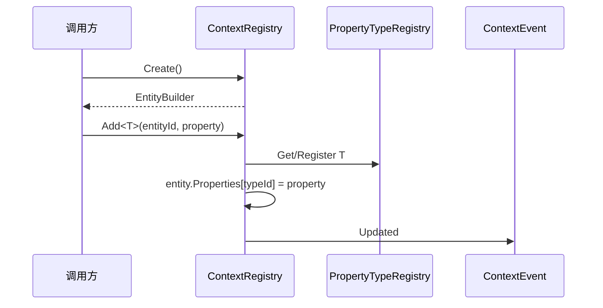

# Ability-Kit Context 上下文注册与快照模块开发设计文档

> **阅读对象**：需要理解 Ability-Kit 上下文数据容器、实体属性注册、快照存取机制的框架开发者。
>
> **文档目标**：说明 Context 模块解决什么问题、边界在哪里、核心类型如何协作，以及后续接入其他运行时模块时应注意哪些约束。

---

## 一、设计理念：为什么需要 Context 模块

Context 模块提供一个轻量的运行时上下文注册中心。它不试图替代完整 ECS，而是为技能、触发、战斗计算、快照回放等模块提供一套“按实体 ID 组织属性和快照”的基础能力。

典型痛点包括：

| 问题 | 具体表现 | Context 的处理方式 |
|------|----------|-------------------|
| 临时上下文散落 | 技能释放者、目标、参数、运行状态散落在多个对象中 | 用 `ContextRegistry` 按实体 ID 管理属性集合 |
| 属性类型识别不统一 | 模块之间难以统一判断“是否具备某类数据” | 通过 `PropertyTypeRegistry` 为属性类型分配稳定类型 ID |
| 快照追踪困难 | 临时实体销毁后仍需要回溯来源、Owner 或历史状态 | 用 `SnapshotStorage` 独立保存 `IContextSnapshot` |
| 事件变更不可见 | 属性添加、设置、移除缺少统一通知点 | 用 `ContextEvent` 通知全局或指定实体订阅者 |

核心思想是：实体只是一段 ID，业务数据以属性形式挂在 ID 上，历史状态以快照形式独立保存。

---

## 二、模块边界

### 2.1 Context 负责什么

- 分配和维护上下文实体 ID。
- 为实体挂载、读取、覆盖、移除实现了 `IProperty` 的属性对象。
- 通过属性类型查询实体集合。
- 在属性和实体生命周期变化时派发事件。
- 保存实体快照，并按 `SourceEntityId`、`OwnerEntityId` 建立反向索引。

### 2.2 Context 不负责什么

- 不负责系统调度，不会主动 Tick。
- 不负责组件序列化协议，只保存调用者传入的快照对象。
- 不负责 ECS 级别的 archetype、chunk、稀疏集合优化。
- 不负责属性对象的深拷贝和不可变性，需要调用者自行约束。
- 不负责 Unity 场景对象或 GameObject 生命周期。

---

## 三、目录结构

| 路径 | 职责 |
|------|------|
| `Runtime/Registry/ContextRegistry.cs` | 上下文实体与属性的注册中心，提供创建、销毁、增删改查、事件派发 |
| `Runtime/Property/IProperty.cs` | 属性对象的基础标记接口 |
| `Runtime/Property/PropertyType.cs` | 属性类型描述和类型 ID 注册表 |
| `Runtime/Events/ContextEvent*.cs` | 上下文事件、事件类型、事件委托定义 |
| `Runtime/Query/Query.cs` | 基于属性类型的查询封装 |
| `Runtime/Snapshot/IContextSnapshot.cs` | 快照基础接口 |
| `Runtime/Snapshot/ISnapshotAccessor.cs` | 快照访问接口 |
| `Runtime/Snapshot/SnapshotStorage.cs` | 快照保存、查询、销毁标记和索引维护 |
| `Runtime/Internal/TimeUtil.cs` | 内部时间戳工具 |

---

## 四、核心类型与职责

### 4.1 ContextRegistry

`ContextRegistry` 是本包的核心入口。内部维护：

- `_entities`：`entityId -> EntityData`，保存实体和属性字典。
- `_nextEntityId`：递增实体 ID。
- `_globalHandlers`：全局事件订阅者。
- `_idHandlers`：指定实体事件订阅者。
- `_lock`：保护实体、属性和订阅列表的同步锁。

对外能力：

| 方法 | 行为 |
|------|------|
| `Create()` | 创建实体并返回 `EntityBuilder`，同时派发 Created 事件 |
| `Destroy(entityId)` | 派发 Destroying，移除实体，派发 Destroyed |
| `Add<T>` / `Set<T>` | 注册属性类型 ID，写入属性，派发 Updated |
| `Get<T>` / `Has<T>` | 按属性类型读取实体属性 |
| `Remove<T>` | 移除属性并派发 Updated |
| `GetEntitiesWith<T>` | 查询拥有某类属性的实体 ID |
| `Clear()` | 逐个销毁当前实体 |

需要注意：事件处理器是在持有 `_lock` 的调用链中被触发的。处理器里应避免做耗时逻辑，也应避免反向调用可能造成复杂重入的 Context 操作。

### 4.2 EntityBuilder

`EntityBuilder` 是创建实体后的链式属性挂载器：

```csharp
var id = registry.Create()
    .With(new PositionProperty())
    .With(new TeamProperty())
    .Build();
```

它只负责把属性写回 `ContextRegistry`，不保留额外状态。

### 4.3 IProperty 与 PropertyTypeRegistry

属性需要实现 `IProperty`。`ContextRegistry` 在 `Add<T>`、`Set<T>` 时会通过 `PropertyTypeRegistry.Instance` 获取类型 ID；如果该类型尚未注册，则立即注册。

这使不同模块可以用类型作为属性身份，不需要在业务侧手写字符串 Key。

### 4.4 ContextEvent

事件用于暴露实体和属性变化。当前主要事件流包括：

- 实体创建：`ContextEvent.Created(id)`
- 实体销毁前：`ContextEvent.Destroying(id)`
- 实体销毁后：`ContextEvent.Destroyed(id)`
- 属性变化：`ContextEvent.Updated(id, propertyTypeId, key, oldValue, newValue)`

事件订阅分为全局订阅和指定实体订阅。若多个处理器抛异常，`RaiseEvent` 会收集为 `AggregateException` 抛出。

### 4.5 SnapshotStorage

`SnapshotStorage` 独立于 `ContextRegistry`。它保存 `IContextSnapshot`，并根据快照是否实现额外接口建立索引：

| 接口 | 含义 | 索引 |
|------|------|------|
| `IContextSnapshot` | 快照基础信息，至少包含 `EntityId` | `_snapshots` |
| `ISourceContext` | 快照来源实体 | `_bySource` |
| `IOwnerContext` | 快照归属实体 | `_byOwner` |
| `IDestroyableSnapshot` | 可标记销毁状态 | `MarkDestroyed` |

快照保存和索引更新也使用 `_lock` 保护。`Remove` 会同步清理 source/owner 索引中的实体 ID。

---

## 五、执行流程

### 5.1 创建和挂载属性



### 5.2 销毁实体

`Destroy(entityId)` 会先派发 Destroying，再从 `_entities` 移除实体，最后派发 Destroyed。快照不会自动删除；如果需要保留历史状态，调用者应在销毁前保存快照，或者在销毁后调用 `SnapshotStorage.MarkDestroyed` 标记状态。

### 5.3 查询实体

`GetEntitiesWith<T>` 会先取得属性类型 ID，再扫描 `_entities`，返回拥有该类型属性的实体 ID 列表。当前实现偏轻量，适合中小规模上下文或阶段性查询；高频大规模查询后续可以补充增量索引。

---

## 六、扩展点

- 新增上下文属性：实现 `IProperty`，直接挂载到实体。
- 新增快照类型：实现 `IContextSnapshot`，需要来源或归属查询时再实现 `ISourceContext` / `IOwnerContext`。
- 订阅变更：通过 `Subscribe(handler)` 监听全局变化，或 `Subscribe(entityId, handler)` 监听指定实体。
- 查询封装：在 `Runtime/Query` 下扩展更语义化的查询 API，隐藏属性类型细节。

---

## 七、使用示例

```csharp
public sealed class HealthProperty : IProperty
{
    public int Value;
}

var registry = new ContextRegistry();

registry.Subscribe(evt =>
{
    Console.WriteLine($"{evt.Type} entity={evt.EntityId}");
});

var entityId = registry.Create()
    .With(new HealthProperty { Value = 100 })
    .Build();

var hp = registry.Get<HealthProperty>(entityId);
hp.Value -= 10;
registry.Set(entityId, hp);

foreach (var id in registry.GetEntitiesWith<HealthProperty>())
{
    Console.WriteLine(id);
}
```

---

## 八、注意事项与当前限制

- `ContextRegistry` 的属性对象按引用保存，修改属性内部字段不会自动派发事件；需要通过 `Set` 重新写入才能通知。
- `Has<T>` 当前在持锁区域内调用 `Get<T>`，C# 的 `lock` 支持同线程重入，因此可以工作，但后续若替换同步机制要注意这一点。
- 事件处理器抛异常会影响当前操作调用方，需要业务层决定是否捕获。
- 快照和实体注册中心没有自动同步销毁关系，调用方需要显式保存、移除或标记快照。
- `SnapshotStorage.Save` 对同一个快照重复保存时会向 source/owner 索引追加 ID，后续可考虑先移除旧索引再重建，避免重复索引项。

---

## 九、后续演进

- 为 `ContextRegistry` 增加属性类型到实体集合的增量索引，降低查询扫描成本。
- 为事件派发增加安全队列或延迟派发模式，减少锁内回调风险。
- 为快照提供版本号、时间戳和序列化适配层。
- 增加只读属性访问或不可变属性约束，降低引用共享导致的状态不一致。

---

*文档版本：1.0*  
*最后更新：2026-06-05*
