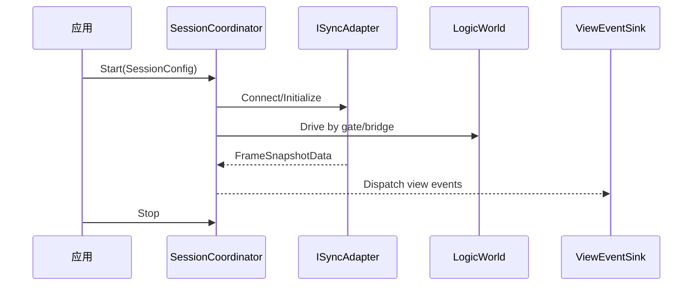

# Ability-Kit Coordinator 会话协调模块开发设计文档

> **阅读对象**：需要协调逻辑世界、表现层、同步适配器、玩家输入和远端传输的开发者。
>
> **文档目标**：说明 Coordinator 包如何把单局会话从“创建、连接、同步、驱动、销毁”串起来。

---

## 一、设计理念

Coordinator 是会话层编排器。它位于 Host/World 与 View/Network 之间，负责把本地同步、远端同步、混合同步等策略统一成 `ISyncAdapter`，并通过 `SessionCoordinator` 管理 session 生命周期。

它解决的问题是：战斗会话通常不是单一系统能完成的，既有逻辑世界驱动，又有表现事件、实体生成、网络端点、输入、快照和回放。Coordinator 将这些接口化，便于示例和真实项目替换实现。

---

## 二、模块边界

负责：

- 定义 `ISessionCoordinator`、`ISessionCoordinatorHost`。
- 定义逻辑世界驱动桥接和驱动闸门接口。
- 提供 `SessionCoordinator`、`SessionConfig`、`SessionHooks`、`SessionId`。
- 提供本地、远端、混合同步适配器和工厂。
- 定义玩家输入、实体状态、帧快照、网络端点等传输数据。
- 提供 CoordinatorPayloadCodec 作为包内负载编解码入口。

不负责：

- 不实现具体网络连接。
- 不实现具体 World 逻辑。
- 不承担 Unity 视图对象创建，只抽象 `ISpawnService`、`IViewEventSink`。

---

## 三、目录结构

| 路径 | 职责 |
|------|------|
| `Runtime/Core` | Session 协调器、配置、枚举、Hook、驱动桥接 |
| `Runtime/Adapters` | Local/Remote/Hybrid sync adapter |
| `Runtime/Data` | FrameSnapshotData、PlayerInput、EntityState、NetworkEndpoint |
| `Runtime/Transport` | `IRemoteBattleSyncTransport` 远端同步传输抽象 |
| `docs/ET-Integration-Guide.md` | ET 集成说明 |

---

## 四、核心流程

---

## 五、扩展点

- 实现 `IRemoteBattleSyncTransport` 接入真实网络。
- 实现 `ILogicWorldDriverBridge` 连接不同 World 运行时。
- 实现 `IViewEventSink` 将逻辑事件转为 Unity/MonoGame 表现。
- 通过 `SessionHooks` 接入日志、诊断、加载和释放动作。

---

## 六、注意事项

- Local/Remote/Hybrid adapter 是同步策略，不应包含具体 UI 或网络协议细节。
- `CoordinatorPayloadCodec` 应与协议包版本保持一致。
- 会话 ID、网络端点和玩家输入是跨层数据，字段变更需要同步客户端和服务端。
- 当前已有 `docs/` 小写目录，本次设计文档统一放在 `Document/`，原集成指南保留。

---

*文档版本：1.0*  
*最后更新：2026-06-05*
