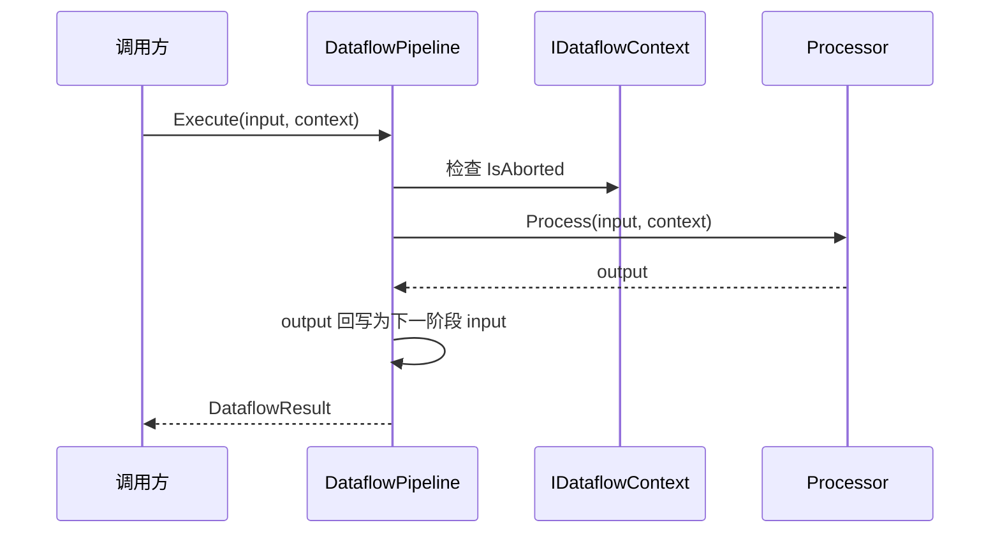

# Ability-Kit Dataflow 数据流处理模块开发设计文档

> **阅读对象**：需要编写战斗计算、规则校验、数值修正、流水线处理逻辑的框架开发者。
>
> **文档目标**：说明 Dataflow 模块如何组织处理器链、上下文槽位和执行结果，以及当前实现中需要遵守的类型约束。

---

## 一、设计理念：为什么需要 Dataflow 模块

Dataflow 模块用于把一段复杂计算拆成多个可组合的处理阶段。它适合表达“输入数据经过校验、修正、条件分支、中断判断，最终得到输出”的流程。

在战斗或技能系统中，常见问题是：

| 问题 | 表现 | Dataflow 的解决方式 |
|------|------|--------------------|
| 计算步骤散落 | 校验、修正、日志、打断逻辑混在一个函数里 | 通过 `IDataflowProcessor` 拆分为处理器 |
| 处理阶段难复用 | 同一段规则在不同技能中重复实现 | 处理器可以加入不同 Pipeline |
| 中间状态难传递 | 暴击、来源、临时参数需要跨阶段共享 | 通过 `IDataflowContext` 的 typed slot 保存 |
| 错误和中断不统一 | 有的抛异常，有的返回特殊值 | 用 `DataflowResult` 和 `context.Abort()` 统一表达 |

核心思想是：让业务计算沿着明确的处理器列表前进，每个处理器只关心当前输入、上下文和自己的输出。

---

## 二、模块边界

### 2.1 Dataflow 负责什么

- 定义数据处理器接口和抽象基类。
- 管理处理器链的添加、插入、移除和执行。
- 提供执行上下文，用于跨处理器共享临时数据。
- 封装成功、失败、中断三类执行结果。
- 提供常见处理器模板：校验、条件、打断、组合、日志。

### 2.2 Dataflow 不负责什么

- 不负责调度 Tick，也不维护时间。
- 不负责依赖注入和处理器生命周期。
- 不负责异步执行或线程切换。
- 不负责输入输出对象的深拷贝。
- 不负责战斗领域规则本身，只提供组合骨架。

---

## 三、目录结构

| 路径 | 职责 |
|------|------|
| `Runtime/Core/Pipeline/DataflowPipeline.cs` | Pipeline 接口、泛型实现、Builder 和扩展入口 |
| `Runtime/Core/Pipeline/DataflowResult.cs` | 执行结果模型，表达成功、失败、中断 |
| `Runtime/Core/Context/IDataflowContext.cs` | 上下文接口 |
| `Runtime/Core/Context/DataflowContext.cs` | 上下文实现，保存 Source、Abort 状态和槽位 |
| `Runtime/Core/Context/DataflowSlots.cs` | typed slot 定义 |
| `Runtime/Core/Processor/IDataflowProcessor.cs` | 处理器接口与抽象基类 |
| `Runtime/Core/Processor/CommonProcessors.cs` | 常用处理器模板 |

---

## 四、核心类型与职责

### 4.1 DataflowPipeline<TInput, TOutput>

`DataflowPipeline<TInput, TOutput>` 是处理器链容器。内部使用 `List<IDataflowProcessor<TInput, TOutput>>` 保存处理阶段。

核心 API：

| API | 行为 |
|-----|------|
| `Execute(input, context)` | 顺序执行处理器，返回 `DataflowResult<TOutput>` |
| `AddProcessor` / `AddProcessors` | 追加处理器 |
| `InsertProcessor` | 按索引插入处理器 |
| `RemoveProcessor` | 删除指定索引处理器 |
| `Clear` | 清空处理器链 |
| `Clone` | 复制 Pipeline 结构，处理器实例仍为同一引用 |

执行时，如果 `context` 为 null，会创建新的 `DataflowContext`。如果没有处理器，当前实现返回 `Success(default, 0)`。

### 4.2 IDataflowProcessor<TInput, TOutput>

处理器是 Pipeline 的最小执行单元：

```csharp
public interface IDataflowProcessor<TInput, TOutput>
{
    string Name { get; }
    TOutput Process(TInput input, IDataflowContext context);
}
```

抽象基类 `DataflowProcessor<TInput, TOutput>` 通常负责公共外壳，子类实现核心处理逻辑。

### 4.3 IDataflowContext 与 DataflowContext

上下文承担三个职责：

- 保存 `Source`，用于记录本次流水线来源对象。
- 保存 `IsAborted`，处理器可以调用 `Abort()` 终止后续阶段。
- 保存 typed slot，用于跨处理器传递临时数据。

这使处理器不需要彼此直接引用，只通过上下文读写共享信息。

### 4.4 DataflowResult<T>

执行结果记录：

- 是否成功。
- 是否中断。
- 异常信息。
- 输出值。
- 已处理的处理器数量。

Pipeline 捕获处理器异常后会返回 Failure，而不是继续向外直接抛出。

### 4.5 CommonProcessors

当前内置模板包括：

| 类型 | 职责 |
|------|------|
| `ValidatorProcessor<TInput>` | 校验输入，不通过时调用 `context.Abort()` 并返回默认值 |
| `ConditionalProcessor<TInput,TOutput>` | 根据条件选择 true/false 分支处理 |
| `InterruptProcessor<TInput,TOutput>` | 满足条件时中断 Pipeline，同时仍可执行转换 |
| `CompositeProcessor<TInput,TOutput>` | 将多个处理器包装成一个处理器 |
| `LoggingProcessor<TInput>` | 输出输入和输出日志，默认写到 `Console.WriteLine` |

---

## 五、执行流程



当前实现中，每个处理器返回 `TOutput` 后，如果输出不为 null，Pipeline 会执行：

```csharp
input = (TInput)(object)output;
```

因此当前 Pipeline 更适合同形转换，也就是 `TInput` 与 `TOutput` 相同，或输出对象能安全转换回输入类型。若希望真正支持异形流水线，需要后续改造为分阶段泛型链，或限制中间处理器的类型关系。

---

## 六、扩展点

- 新增处理器：实现 `IDataflowProcessor<TInput,TOutput>` 或继承 `DataflowProcessor<TInput,TOutput>`。
- 新增校验器：继承 `ValidatorProcessor<TInput>`。
- 新增条件阶段：继承 `ConditionalProcessor<TInput,TOutput>`。
- 新增上下文槽位：在业务模块定义 typed slot，避免使用字符串 Key。
- 日志适配：继承 `LoggingProcessor<TInput>` 并重写 `Log`，对接框架诊断系统。

---

## 七、使用示例

```csharp
public sealed class DamageContext
{
    public int Value;
}

public sealed class ClampDamageProcessor
    : DataflowProcessor<DamageContext, DamageContext>
{
    protected override DamageContext OnProcess(DamageContext input, IDataflowContext context)
    {
        input.Value = Math.Max(0, input.Value);
        return input;
    }
}

var pipeline = DataflowPipelineExtensions
    .NewPipeline<DamageContext, DamageContext>("Damage")
    .Add(new LoggingProcessor<DamageContext>("before damage"))
    .Add(new ClampDamageProcessor())
    .Build();

var result = pipeline.Execute(new DamageContext { Value = 100 }, new DataflowContext());

if (result.IsSuccess)
{
    Console.WriteLine(result.Output.Value);
}
```

---

## 八、注意事项与当前限制

- 当前 Pipeline 通过强制转换把输出作为下一阶段输入，推荐优先使用 `TInput == TOutput` 的处理链。
- `Clone()` 复制的是处理器引用，若处理器有内部状态，多个 Pipeline 会共享该状态。
- `CompositeProcessor` 当前每次仍用原始 input 调用后续处理器，没有把上一个处理器的 output 作为下一个 input；它更适合作为并列封装，不适合替代主 Pipeline 的链式变换。
- `LoggingProcessor` 使用 `Console.WriteLine`，在 Unity 环境下需要适配到 Unity 日志或诊断模块。
- 处理器异常会被 Pipeline 捕获并转换为 Failure；调用方需要检查结果，而不是只依赖异常。

---

## 九、后续演进

- 明确区分同形 Pipeline 与异形 Pipeline，避免运行期强转风险。
- 为处理器增加生命周期或配置描述，方便按需构建标准计算链。
- 将日志输出接入 `com.abilitykit.diagnostics` 或 trace 包。
- 增加 Pipeline 执行追踪，记录每个处理器耗时、输入输出摘要和中断原因。

---

*文档版本：1.0*  
*最后更新：2026-06-05*
