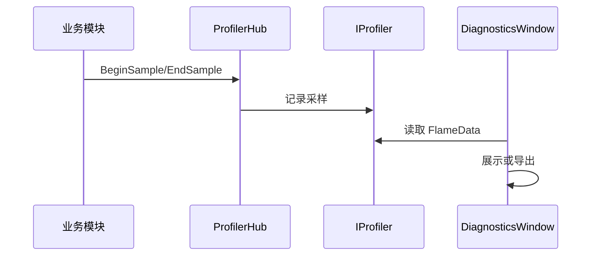

# Ability-Kit Diagnostics 诊断与性能分析模块开发设计文档

> **阅读对象**：需要在开发期采集性能片段、查看诊断窗口、导出分析数据的框架和工具开发者。
>
> **文档目标**：说明 Diagnostics 包的运行时 profiler 抽象、火焰数据模型、编辑器窗口和导出器边界。

---

## 一、设计理念

Diagnostics 模块用于开发期诊断和性能分析。它提供运行时轻量 profiler 抽象，让业务模块可以用统一入口记录分析区间；编辑器侧再通过窗口和导出器查看或导出采样数据。

该包强调“可选接入”。没有诊断需求时可以使用 `NullProfiler`，避免业务代码到处写条件判断。

---

## 二、模块边界

负责：

- 定义 `IProfiler` 采样接口。
- 提供 `ProfilerHub` 统一入口。
- 提供 `NullProfiler` 空实现。
- 提供 `EditorProfiler` 编辑器实现。
- 定义 `FlameData` 火焰图/层级采样数据。
- 提供 `DiagnosticsWindow` 编辑器查看入口。
- 提供基础和高级导出器。

不负责：

- 不替代 Unity Profiler。
- 不负责线上遥测上传。
- 不负责自动插桩所有模块。
- 不承担业务日志系统。

---

## 三、目录结构

| 路径 | 职责 |
|------|------|
| `Runtime/Core/IProfiler.cs` | profiler 接口 |
| `Runtime/Core/ProfilerHub.cs` | 全局 profiler 入口 |
| `Runtime/Core/NullProfiler.cs` | 空实现 |
| `Runtime/Core/EditorProfiler.cs` | 编辑器 profiler 实现 |
| `Runtime/Core/FlameData.cs` | 火焰图数据模型 |
| `Editor/Windows/DiagnosticsWindow.cs` | Unity 编辑器诊断窗口 |
| `Editor/Exporters/Exporters.cs` | 基础导出能力 |
| `Editor/Exporters/AdvancedExporters.cs` | 高级导出能力 |

---

## 四、典型流程

---

## 五、使用建议

- 运行时代码只依赖 `IProfiler` 或 `ProfilerHub`，不要直接依赖 Editor 窗口。
- 默认实现应可切换到 `NullProfiler`，保证生产环境没有额外开销。
- 采样名称应稳定，便于跨版本比较。
- 导出数据格式变更时需要记录版本，避免旧分析工具无法读取。

---

*文档版本：1.0*  
*最后更新：2026-06-05*
