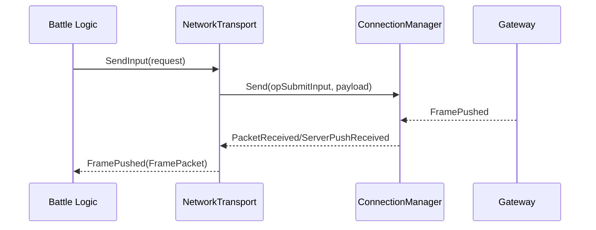
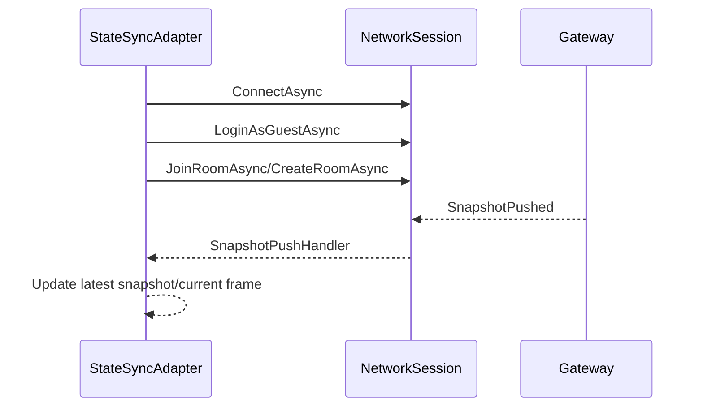

# Ability-Kit Battle Transport 战斗传输运行时模块开发设计文档

> **阅读对象**：需要把战斗逻辑与网络 Gateway、状态同步适配器连接起来的运行时开发者。
>
> **文档目标**：说明 Battle Transport Runtime 的网络抽象、Moba 会话实现、状态同步适配器和配置边界。

---

## 一、设计理念

该包提供可复用的战斗传输实现，用于把 AbilityKit 战斗逻辑和网络运行时连接起来。它同时包含两层内容：

- 通用战斗逻辑传输：`NetworkTransport` 实现 `IBattleLogicTransport`。
- Moba 示例传输：`NetworkSession`、`TcpNetworkClient`、`StateSyncAdapter` 等面向 Moba Gateway 的实现。

因此它既是框架传输样板，也是 Moba 示例的客户端网络运行时。

---

## 二、模块边界

负责：

- 根据 `NetworkTransportOptions` 连接 Gateway。
- 发送 CreateWorld、Join、Leave、SubmitInput 请求。
- 接收 frame pushed 并派发 `FramePushed` 事件。
- 在 Moba 路径中维护 session/login/room 状态。
- 提供状态同步适配器，把服务器推送转换为 `IWorldSnapshot`、`IFrameData`。

不负责：

- 不定义业务协议结构，协议结构来自 `com.abilitykit.protocol.moba`。
- 不负责服务端房间和世界逻辑。
- 不负责 Unity 表现层。
- 不负责断线重连策略的完整实现。
- 不负责传输安全和加密。

---

## 三、目录结构

| 路径 | 职责 |
|------|------|
| `Runtime/Battle/Transport/NetworkTransport.cs` | 通用 Battle Logic 网络传输 |
| `Runtime/Battle/Transport/NetworkTransportOptions.cs` | OpCode、序列化委托、TransportFactory 配置 |
| `Runtime/Battle/Transport/NullBattleLogicTransport.cs` | 空传输实现 |
| `Runtime/Battle/Transport/GenericNetworkClient.cs` | 通用网络客户端包装 |
| `Runtime/Battle/Transport/INetworkClient.cs` | 网络客户端抽象 |
| `Runtime/Battle/Transport/Moba/NetworkSession.cs` | Moba 会话状态、登录、房间、输入提交 |
| `Runtime/Battle/Transport/Moba/TcpNetworkClient.cs` | TCP 网络客户端 |
| `Runtime/Battle/Transport/Moba/NetworkProtocol.cs` | Moba 网络协议编解码入口 |
| `Runtime/Battle/Transport/Moba/TransportModels.cs` | 传输模型 |
| `Runtime/Battle/Transport/Moba/StateSyncModels.cs` | 状态同步模型 |
| `Runtime/Battle/Transport/Moba/Client` | 客户端状态同步适配器和快照 codec |

---

## 四、核心类型

### 4.1 NetworkTransport

`NetworkTransport` 实现 `IBattleLogicTransport`，内部组合：

- `ConnectionManager`：底层连接和包事件。
- `RequestClient`：请求/响应能力。
- `NetworkTransportOptions`：OpCode 和序列化委托配置。

发送请求时不会直接依赖某种协议类型，而是调用 options 中的序列化委托：

- `SerializeCreateWorld`
- `SerializeJoin`
- `SerializeLeave`
- `SerializeSubmitInput`

接收推送时，如果 opCode 等于 `OpFramePushed`，通过 `DeserializeFramePushed` 转为 `FramePacket` 并触发 `FramePushed`。

### 4.2 NetworkTransportOptions

Options 是该包按需组合的关键。它把网络传输、OpCode 和编解码函数全部交给宿主配置，避免传输层硬编码协议后端。

必填项包括：

- `TransportFactory`
- `Port`
- 请求 OpCode
- 请求序列化委托
- frame pushed 反序列化委托

### 4.3 NetworkSession

Moba 会话维护 `SessionState`：

`Disconnected -> Connecting -> Authenticating -> Connected -> InRoom`

它通过 `INetworkClient` 执行连接、guest login、token login、join/create room、leave room、submit frame input，并支持按 OpCode 订阅 server push handler。

### 4.4 StateSyncAdapter

`StateSyncAdapter` 实现 `IStateSyncAdapter`，负责：

- 创建和持有 `NetworkSession`。
- 订阅 SnapshotPushed 和 FramePushed。
- 维护 latest snapshot、current frame、local actor id。
- 对外派发连接变化、帧推进、快照接收事件。
- 调用 `SubmitFrameInputAsync` 提交本地输入。

---

## 五、执行流程

Moba 客户端状态同步流程：

---

## 六、注意事项

- `package.json` 当前未声明依赖，但 asmdef 引用了 `AbilityKit.Game.Battle.Runtime`、`AbilityKit.Network.Runtime`、World 包、`AbilityKit.Protocol.Moba` 和 `MemoryPack`；按需组合时需要补齐依赖。
- `NetworkTransport.TryRenewSessionAsync` 通过手写 JSON 构造 RenewSession payload，后续应改为协议 serializer。
- `NetworkSession.ConnectAsync` 依赖状态变化结束 spin wait，若底层 client 未更新状态可能等待较久；应增加明确超时。
- `StateSyncAdapter.ConnectAsync` 是 `async void`，适合事件式入口，但异常和完成状态不易追踪，后续可提供 Task 版本。
- `Disconnect()` 使用 `.Wait()`，在同步上下文环境中可能带来阻塞风险。

---

## 七、后续演进

- 将通用 Battle Transport 与 Moba 示例 Transport 进一步拆包。
- 为 session 登录、入房、重连增加超时和错误码。
- 统一 RenewSession、Room、StateSync 编解码入口。
- 为 `StateSyncAdapter` 增加可测试的 Task API。

---

*文档版本：1.0*  
*最后更新：2026-06-05*
