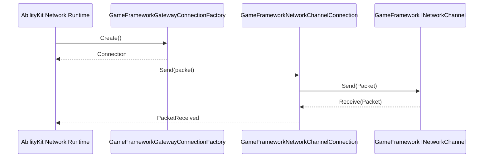

# Ability-Kit GameFramework Network 网络适配模块开发设计文档

> **阅读对象**：需要把 GameFramework 网络通道接入 AbilityKit Gateway/Network Runtime 的开发者。
>
> **文档目标**：说明该包如何在 GameFramework Network 与 AbilityKit 网络抽象之间做适配。

---

## 一、设计理念

`com.abilitykit.gameframework.network` 是桥接包。GameFramework 提供 `INetworkChannel`、`Packet`、`IPacketHeader` 等通道模型，AbilityKit 网络运行时需要统一的连接工厂和数据包传输抽象。该包把二者连接起来。

---

## 二、模块边界

负责：

- 定义 AbilityKit Gateway 包头和包体。
- 提供 GameFramework 网络通道 helper。
- 提供 Gateway connection factory。
- 将 GameFramework 网络事件转为 AbilityKit 可消费的连接事件。

不负责：

- 不定义业务协议。
- 不负责 GameFramework 网络管理器本体。
- 不实现 MemoryPack/Json 序列化。
- 不负责战斗会话状态。

---

## 三、目录结构

| 文件 | 职责 |
|------|------|
| `AbilityKitGatewayPacketHeader.cs` | AbilityKit Gateway 包头 |
| `AbilityKitGatewayPacket.cs` | Gateway Packet 数据体 |
| `AbilityKitGatewayNetworkChannelHelper.cs` | GameFramework channel helper |
| `GameFrameworkNetworkChannelConnection.cs` | 通道连接适配 |
| `GameFrameworkGatewayConnectionFactory.cs` | Gateway 连接工厂 |

---

## 四、典型流程

---

## 五、注意事项

- 该包依赖 GameFramework 包中的网络基础类型。
- 包头字段必须与服务端 Gateway 帧协议保持一致。
- 如果 AbilityKit Network Runtime 的连接接口变化，需要同步更新 connection factory。

---

*文档版本：1.0*  
*最后更新：2026-06-05*
