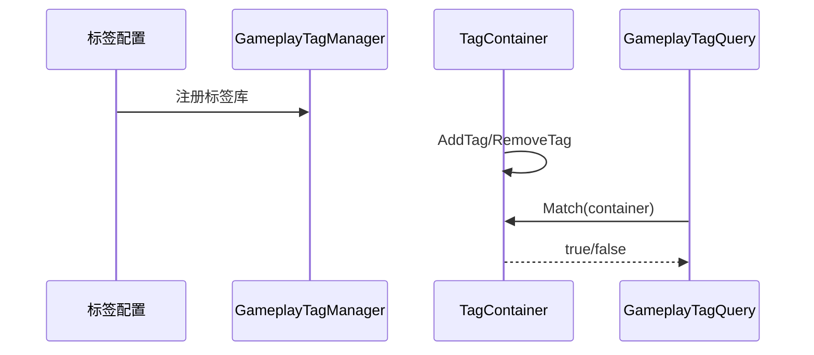

# Ability-Kit GameplayTags 标签系统模块开发设计文档

> **阅读对象**：需要用层级标签表达状态、阵营、技能条件、效果需求和编辑器标签库的开发者。
>
> **文档目标**：说明 GameplayTags 包的运行时模型、服务接口、模板机制和编辑器工具边界。

---

## 一、设计理念

GameplayTags 用一套层级标签表达游戏对象的语义状态，例如 `State.Stunned`、`Team.Red`、`Ability.Fireball`。它比散落的 bool/enum 更适合组合查询、配置化需求和编辑器管理。

该包同时包含运行时标签容器、标签查询、服务接口、持久化和编辑器管理窗口。

---

## 二、模块边界

负责：

- 定义 `GameplayTag`、`GameplayTagContainer`、`GameplayTagCollection`。
- 提供标签增删变化 `GameplayTagDelta` 和堆叠 `GameplayTagStack`。
- 提供 `GameplayTagQuery`、`GameplayTagRequirements`、`ContinuousTagRequirements`。
- 提供 `IGameplayTagService` 与事件订阅接口。
- 提供标签模板和运行时注册表。
- 提供编辑器标签数据库、树视图、导出器和管理窗口。

不负责：

- 不直接修改战斗属性。
- 不决定标签命名规范，项目应提供自己的标签库。
- 不承担网络同步，需由快照/协议层转换。

---

## 三、目录结构

| 路径 | 职责 |
|------|------|
| `Runtime/GameplayTags/Core` | 标签、容器、查询、需求、管理器 |
| `Runtime/GameplayTags/Service` | 标签服务接口、事件和实现 |
| `Runtime/GameplayTags/Template` | 标签模板和模板注册表 |
| `Runtime/GameplayTags/Persistence` | 默认标签序列化 |
| `Runtime/GameplayTags/Utilities` | 标签库、加载器和 Unity 辅助 |
| `Editor/GameplayTags` | 标签编辑器、数据库、导出器、校验器 |

---

## 四、核心类型

- `GameplayTag`：单个标签值。
- `GameplayTagContainer`：对象持有的标签集合。
- `GameplayTagQuery`：组合查询表达式。
- `GameplayTagRequirements`：必须有/必须无等需求集合。
- `GameplayTagManager`：标签注册和运行时管理。
- `GameplayTagTemplate`：可复用标签模板配置。
- `IGameplayTagService`：系统级读写和通知接口。

---

## 五、典型流程

---

## 六、注意事项

- 标签命名应保持层级稳定，避免频繁改名导致配置失效。
- 编辑器导出 JSON/Lib 后，运行时加载器需要读取同一份源。
- 标签堆叠和标签存在是两个概念，移除时要明确是否按层数递减。
- `base.editor` 中也存在早期 GameplayTag 编辑器代码，后续应以本包编辑器为准并减少重复。

---

*文档版本：1.0*  
*最后更新：2026-06-05*
