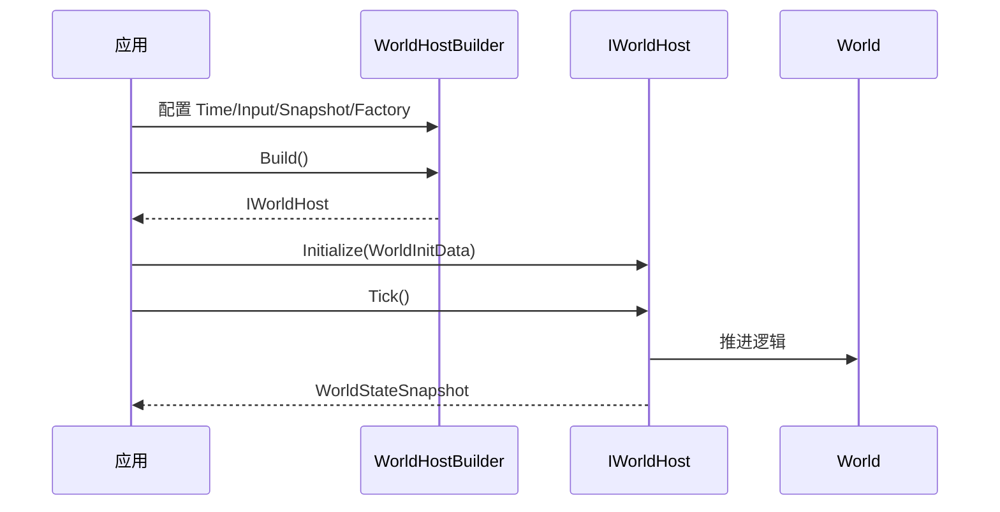

# Ability-Kit Host 运行时宿主模块开发设计文档

> **阅读对象**：需要把 World、输入、快照、连接和模块生命周期组织到同一运行时的开发者。
>
> **文档目标**：说明 Host 包的宿主边界、核心抽象、运行时组合方式和与 `host.extension`、World 包的关系。

---

## 一、设计理念

Host 模块是 AbilityKit 逻辑运行时的组合入口。它不直接实现某个玩法系统，而是定义“一个世界如何被创建、初始化、驱动、接收输入、产出快照、连接客户端”的公共宿主模型。

该包的价值在于把不同运行环境统一起来：

- 控制台样例可以用本地输入驱动。
- Unity 可以通过外部 Update 驱动。
- 网络运行时可以通过连接适配器接收消息。
- 测试环境可以注入固定步长和简单快照提供器。

---

## 二、模块边界

Host 负责：

- 定义 `IWorldHost`、`IHostServer`、`IHostClient` 等宿主接口。
- 定义世界初始化数据、世界状态快照和快照提供接口。
- 提供 `WorldHostBuilder`、`DefaultWorldFactory` 等构建工具。
- 提供 `HostRuntime`、`IHostRuntimeModule`、`HostRuntimeModuleHost` 模块化运行时。
- 提供连接适配接口和 ServerMessage 模型。
- 提供固定步长时间驱动、本地输入驱动和简单快照提供器。

Host 不负责：

- 不实现具体 World 内部逻辑。
- 不实现具体网络协议和帧格式。
- 不负责 Unity 表现层。
- 不决定服务容器和 World 类型注册细节，这些由 World DI/extension 包补齐。

---

## 三、核心目录

| 路径 | 职责 |
|------|------|
| `Runtime/Host/IWorldHost.cs` | 世界宿主接口 |
| `Runtime/Host/IHostServer.cs` / `IHostClient.cs` | 服务端/客户端宿主抽象 |
| `Runtime/Host/WorldInitData.cs` | 世界初始化参数 |
| `Runtime/Host/WorldStateSnapshot.cs` | 世界快照数据 |
| `Runtime/Host/Builder` | WorldHost 构建器、默认工厂和组件 |
| `Runtime/Host/Framework` | HostRuntime 模块化运行时 |
| `Runtime/Host/Transport` | 连接、消息和连接适配器 |
| `Runtime/Host/Hooks` | Hook 扩展点 |
| `Runtime/Host/WorldBlueprints` | 世界蓝图注册与创建选项 |

---

## 四、核心类型

### 4.1 WorldHostBuilder

构建器用于把时间驱动、输入驱动、连接管理、快照提供器和 World 工厂组合成一个宿主。它是示例和测试代码最适合使用的入口。

### 4.2 HostRuntime

`HostRuntime` 表示模块化运行时，模块通过 `IHostRuntimeModule` 接入。`HostRuntimeFeatures` 提供模块间共享能力集合，避免模块直接依赖具体实现。

### 4.3 Builder Components

组件目录定义了：

- `ITimeDriver` / `FixedStepTimeDriver`
- `IInputDriver` / `LocalInputDriver`
- `IConnectionManager`
- `ISnapshotProvider` / `SimpleSnapshotProvider`

它们让 Host 可以被纯逻辑、Unity、网络或测试环境替换驱动源。

---

## 五、典型流程

---

## 六、注意事项

- Host 是运行时组合层，具体协议、同步、DI 安装不要塞回 Host。
- `WorldStateSnapshot` 是通用快照模型，领域快照应由扩展包或协议包转换。
- 如果接入网络连接，建议通过 `HostClientConnectionAdapter` 把传输层与 Host 消息模型隔离。
- 固定步长驱动适合 deterministic 逻辑；Unity 表现层应只消费结果，不直接改变逻辑时间。

---

*文档版本：1.0*  
*最后更新：2026-06-05*
