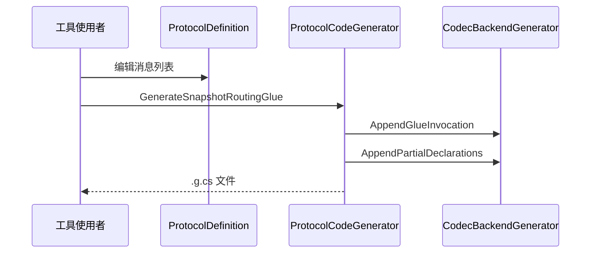

# Ability-Kit Protocol Editor 协议编辑器模块开发设计文档

> **阅读对象**：需要通过 Unity Editor 定义协议、生成 OpCode、生成快照路由胶水代码的工具开发者。
>
> **文档目标**：说明 Protocol Editor 如何用 ScriptableObject 描述协议，并生成运行时代码。

---

## 一、设计理念

Protocol Editor 是协议工具层，不参与运行时消息收发。它把协议定义集中到 `ProtocolDefinition`，再生成 OpCode、协议类型声明、快照路由胶水和后端编解码 Stub。

这样可以让协议结构由资产驱动，减少手写重复代码，并让不同 codec 后端共用同一份定义。

---

## 二、模块边界

负责：

- 提供 `ProtocolDefinition` ScriptableObject。
- 提供协议编辑窗口和导入窗口。
- 根据定义生成 OpCode、协议类型和快照路由代码。
- 支持 CustomBinary、Protobuf、Json 三类 backend 生成器扩展点。

不负责：

- 不在运行时加载协议资产。
- 不负责编译生成代码后的业务实现。
- 不负责 MemoryPack 或 Protobuf 运行库安装。
- 不负责网络连接和消息派发。

---

## 三、目录结构

| 路径 | 职责 |
|------|------|
| `Editor/ProtocolEditor/Schema/ProtocolDefinition.cs` | 协议定义资产 |
| `Editor/ProtocolEditor/Generator/ProtocolCodeGenerator.cs` | 代码生成主入口 |
| `Editor/ProtocolEditor/Generator/ICodecBackendGenerator.cs` | Codec backend 生成器接口 |
| `Editor/ProtocolEditor/Generator/CodecBackendGenerators.cs` | Backend 注册表 |
| `Editor/ProtocolEditor/Generator/CustomBinaryCodecBackendGenerator.cs` | CustomBinary stub 生成 |
| `Editor/ProtocolEditor/Generator/ProtobufCodecBackendGenerator.cs` | Protobuf stub 生成 |
| `Editor/ProtocolEditor/UI/ProtocolEditorWindow.cs` | 协议编辑窗口 |
| `Editor/ProtocolEditor/UI/SnapshotRoutingImporterWindow.cs` | 快照路由导入窗口 |
| `Editor/ProtocolEditor/UI/CSharpTypeNameUtility.cs` | C# 类型名辅助 |

---

## 四、核心类型

### 4.1 ProtocolDefinition

`ProtocolDefinition` 是 ScriptableObject，包含：

- `RegistryId`：生成 SnapshotRegistry 的标识。
- `Domain`：协议领域。
- `Messages`：消息定义列表。

每条 `MessageDefinition` 包含：

| 字段 | 含义 |
|------|------|
| `Name` | 消息名，用于方法名和 OpCode 常量 |
| `OpCode` | 协议操作码 |
| `Channel` | SnapshotDecoder、SnapshotCmdHandler、SnapshotPipelineStage |
| `PayloadTypeName` | 负载类型名 |
| `PipelineOrder` | Pipeline 阶段排序 |
| `Backend` | CustomBinary、Protobuf、Json |

### 4.2 ProtocolCodeGenerator

生成入口包括：

- `GenerateOpCodes`：生成 `OpCodes.g.cs`。
- `GenerateProtocolTypesWithAttributes`：生成带 `ProtocolOpCodeAttribute` 和 `MemoryPackable` 的协议结构声明。
- `GenerateSnapshotRoutingGlue`：生成 SnapshotDecoder/CmdHandler/PipelineStage 特性胶水。
- `GenerateCodecBackendStubs`：按使用到的 backend 生成实现 stub。
- `GenerateCustomBinaryBackendStubs`：单独生成 CustomBinary stub。

生成后会调用 `AssetDatabase.Refresh()`，让 Unity 导入新文件。

### 4.3 CodecBackendGenerators

Backend 注册表把 `ProtocolDefinition.CodecBackend` 映射到具体生成器。生成器负责追加胶水调用、partial 声明和实现 Stub。

---

## 五、生成流程

---

## 六、注意事项

- `GenerateProtocolTypesWithAttributes` 当前直接生成 `using MemoryPack;` 和 `[MemoryPackable]`，因此即使选择非 MemoryPack 后端，也需要确认目标工程是否有 MemoryPack 引用。
- 生成代码使用 `internal static partial class` 承载 backend 方法，业务侧需要补齐 partial 实现或生成 Stub。
- `SanitizeIdentifier` 会移除非字母数字下划线字符，协议命名应保持清晰稳定。
- 输出目录由调用方传入，生成前会 `Directory.CreateDirectory`。

---

## 七、后续演进

- 增加协议定义校验：重复 OpCode、空 PayloadType、非法类型名。
- 根据 backend 控制是否生成 MemoryPack using/attribute。
- 为生成产物增加版本戳和源定义路径，便于排查。

---

*文档版本：1.0*  
*最后更新：2026-06-05*
