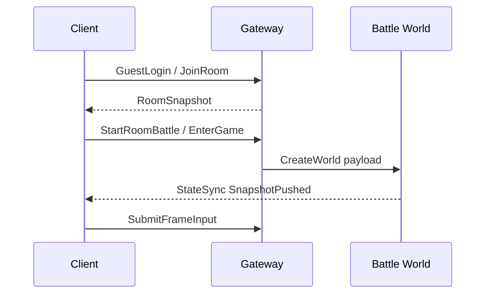

# Ability-Kit Protocol Moba 共享协议模块开发设计文档

> **阅读对象**：需要理解 Moba 示例工程中客户端、Gateway、World、房间和状态同步协议的开发者。
>
> **文档目标**：说明该包是领域协议集合，而不是协议核心框架；梳理各协议目录和生成代码的职责。

---

## 一、设计理念

`com.abilitykit.protocol.moba` 承载最佳实践 Moba 示例的共享协议资产。它把房间、登录、创建世界、进入游戏、帧同步、状态同步、技能输入等数据结构放在一个 Unity/Server 可共享的包中。

该包的定位是“示例领域协议包”，后续真实项目可以参考其拆分方式，但不应该把其中所有 Moba 类型作为框架强依赖。

---

## 二、模块边界

负责：

- 定义 Moba 领域 wire struct。
- 定义 Moba 相关 OpCode 常量。
- 提供部分 CustomBinary/MemoryPack codec。
- 承载 Protocol Editor 生成的 Gateway/GatewayFrameSync 代码。
- 提供房间同步、状态同步、创建世界、进入游戏等共享消息模型。

不负责：

- 不负责网络连接和请求发送。
- 不负责真实房间服务或世界逻辑实现。
- 不负责通用协议注册框架。
- 不负责 Unity 表现层。

---

## 三、目录结构

| 路径 | 职责 |
|------|------|
| `Runtime/Room` | 登录、创建房间、加入房间、房间快照、房间事件 |
| `Runtime/RoomSync` | 房间同步消息、快照请求、增量消息 |
| `Runtime/GatewayTimeSync` | Gateway 时间同步协议 |
| `Runtime/StateSync` | 世界状态同步请求、快照推送和状态快照 codec |
| `Runtime/CreateWorld` | 创建世界初始化 payload 与 codec |
| `Runtime/EnterGame` | 进入 Moba 游戏请求结构与 codec |
| `Runtime/Battle/Input` | 战斗输入 codec，如移动输入 |
| `Runtime/Battle/OpCodes` | 战斗相关 OpCode |
| `Runtime/Skill` | 技能输入结构 |
| `Runtime/Generated/Gateway` | 生成的 Gateway 协议类型 |
| `Runtime/Generated/GatewayFrameSync` | 生成的帧同步协议类型和 CustomBinary |

---

## 四、核心协议组

### 4.1 Room

`WireRoomGatewayTypes.cs` 中定义了 guest login、create room、join room、ready、pick hero、start battle、room snapshot 等 MemoryPack wire struct。

它覆盖从账号进入房间到准备开局的共享数据结构。

### 4.2 StateSync

StateSync 目录提供订阅状态同步、世界快照、Actor spawn/despawn/transform、damage/projectile/area event、state hash 等 codec。它服务于“服务端推状态，客户端应用快照”的路径。

### 4.3 RoomSync

RoomSync 关注房间列表、房间快照和增量事件，适合大厅/房间 UI 的状态刷新。

### 4.4 CreateWorld 与 EnterGame

这两个目录用于 Gateway/World 之间或客户端进入游戏时传递初始化参数。它们把创建世界配置、初始 payload、进入游戏参数与 codec 放在协议层共享。

### 4.5 Generated

Generated 目录是协议编辑器或生成器产物。它包含 OpCodes、WireTypes、WireCustomBinary 等代码，应尽量从定义生成，避免手改后与源定义脱节。

---

## 五、使用流程

---

## 六、注意事项

- asmdef 引用 `AbilityKit.Core`、`AbilityKit.Protocol`、`AbilityKit.Host`、`AbilityKit.Ability`、多个 World 包和 `MemoryPack`，但 package.json 当前没有声明这些依赖；按需组合时需要补齐。
- 该包包含大量示例领域类型，真实项目应按自己的玩法拆成独立 domain protocol 包。
- MemoryPack wire struct 的字段顺序由 `MemoryPackOrder` 决定，变更字段必须考虑兼容性。
- Generated 目录应由工具维护，手动修改需要同步记录来源。

---

*文档版本：1.0*  
*最后更新：2026-06-05*
