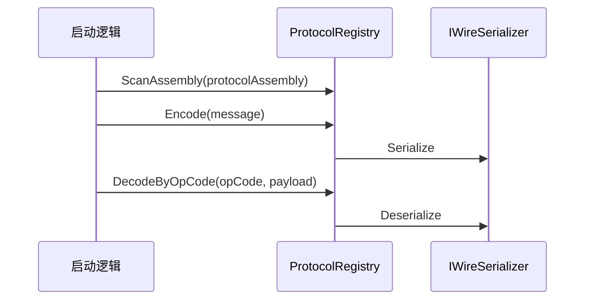

# Ability-Kit Protocol 协议核心模块开发设计文档

> **阅读对象**：需要定义客户端/服务端共享协议、注册 OpCode、切换序列化后端的框架开发者。
>
> **文档目标**：说明 Protocol 核心包的职责边界、注册表和序列化抽象，并区分核心包与 MemoryPack、Moba 协议包的关系。

---

## 一、设计理念

Protocol 核心包提供“协议类型、OpCode、序列化器”三者之间的公共抽象。它只关心如何标识消息、如何把消息变成 byte[] 或文本，以及如何按 OpCode 查找类型。

核心包应保持领域无关；Moba、房间、状态同步等具体协议应放在独立包中。

---

## 二、模块边界

负责：

- 定义 `ProtocolOpCodeAttribute` 和 `ProtocolDirection`。
- 维护 `ProtocolRegistry` 的 OpCode 与 Type 双向映射。
- 定义 `IWireSerializer`、`ITextSerializer`。
- 提供默认二进制对象序列化器和 Newtonsoft Json 文本序列化器。
- 提供 `MessageEnvelope`、ServerPush handler 注册模型。

不负责：

- 不定义具体业务消息。
- 不决定网络帧格式。
- 不强制绑定 MemoryPack；MemoryPack 是可选后端。
- 不负责代码生成，生成工具在 `com.abilitykit.protocol.editor`。

---

## 三、目录结构

| 路径 | 职责 |
|------|------|
| `Runtime/Protocol/ProtocolRegistry.cs` | OpCode 与类型注册、编码解码入口 |
| `Runtime/Protocol/ProtocolOpCodeAttribute.cs` | 协议类型标记 |
| `Runtime/Protocol/MessageEnvelope.cs` | 消息信封结构 |
| `Runtime/Protocol/ServerPushHandlerBase.cs` | 服务端推送处理器基类 |
| `Runtime/Protocol/ServerPushHandlerRegistry.cs` | ServerPush handler 注册 |
| `Runtime/Serialization/IWireSerializer.cs` | 二进制序列化接口 |
| `Runtime/Serialization/ITextSerializer.cs` | 文本序列化接口 |
| `Runtime/Serialization/WireSerializer.cs` | 全局序列化器入口 |
| `Runtime/Serialization/BinaryObjectWireSerializer.cs` | 默认二进制对象序列化 |
| `Runtime/Serialization/JsonTextSerializer.cs` | Newtonsoft Json 文本序列化 |
| `Runtime/Serialization/JsonTextSerializerInstaller.cs` | Json 文本序列化器安装器 |

---

## 四、核心类型

### 4.1 ProtocolRegistry

`ProtocolRegistry.Instance` 是单例注册表。它可以扫描程序集，将带 `ProtocolOpCodeAttribute` 的类型注册到内部字典。

主要 API：

- `ScanAssembly(Assembly)` / `ScanAssembly(params Assembly[])`
- `RegisterType(Type)`
- `Encode<T>(in T value)` / `Encode(object value)`
- `Decode<T>(byte[] payload)`
- `DecodeByOpCode<T>(uint opCode, byte[] payload)`
- `GetType(uint opCode)`
- `GetOpCode<T>()`
- `GetDirection(uint opCode)`
- `Clear()`

重复 OpCode 会抛出异常，避免同一个操作码被多个类型占用。

### 4.2 WireSerializer

`WireSerializer` 是静态序列化入口：

- `Current`：当前二进制序列化器，默认 `BinaryObjectWireSerializer`。
- `TextSerializer`：当前文本序列化器，默认 `JsonTextSerializer`。

可选包可以在启动时设置：

```csharp
WireSerializer.Current = new MemoryPackWireSerializer();
```

### 4.3 ProtocolOpCodeAttribute

协议类型通过 Attribute 声明 OpCode、方向和名称。注册表扫描程序集时读取该 Attribute，建立 Type 映射。

---

## 五、使用流程



---

## 六、注意事项

- `ProtocolRegistry` 构造函数会尝试创建内部 MemoryPack 反射序列化器，失败后回退到 `BinaryObjectWireSerializer`；正式使用 MemoryPack 时推荐通过 `protocol.memorypack` 显式安装。
- `WireSerializer.Current` 和 `ProtocolRegistry` 内部 `_serializer` 是两条入口，接入时要确认使用哪一个，避免后端不一致。
- `package.json` 声明依赖 Newtonsoft Json，asmdef 中也预编译引用 `Newtonsoft.Json.dll`。
- `Encode<T>` 约束 `T : struct`，但 `Encode(object)` 可接受对象；协议类型设计最好保持值类型和不可变字段。

---

## 七、后续演进

- 统一 `WireSerializer.Current` 与 `ProtocolRegistry.SetSerializer` 的使用约定。
- 明确默认二进制对象序列化器的兼容性边界。
- 为注册表增加重复扫描、协议版本和导出诊断。

---

*文档版本：1.0*  
*最后更新：2026-06-05*
