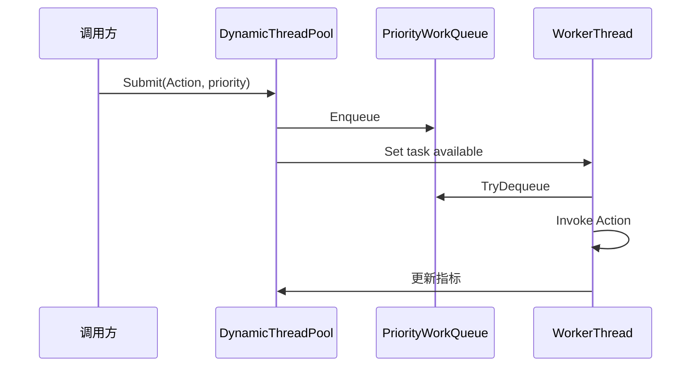
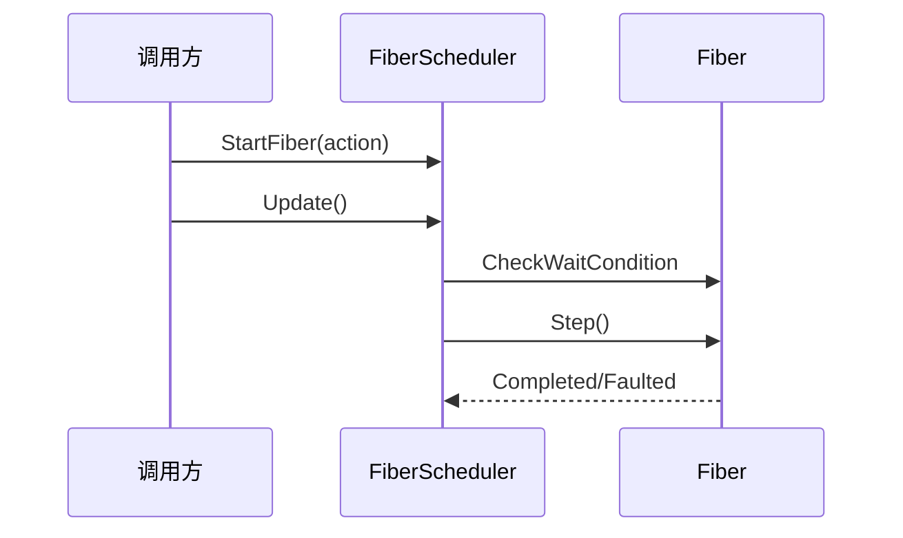

# Ability-Kit Threading 线程与并发工具模块开发设计文档

> **阅读对象**：需要在 Ability-Kit 中使用线程池、并发集合、轻量调度、对象池或同步原语的框架开发者。
>
> **文档目标**：梳理 Threading 包的工具集合边界、主要类型职责、适用场景和当前实现限制，避免误把它当作单一调度框架使用。

---

## 一、设计理念：为什么需要 Threading 模块

Threading 模块是服务端逻辑、模拟运行时和工具链侧的并发基础包。它提供多个相对独立的底层工具：动态线程池、优先级队列、无锁/低锁集合、Fiber 调度、对象池、原子计数、同步原语等。

它的定位不是替代 .NET TPL，而是在 Ability-Kit 的运行环境中提供可控、可裁剪、可按需组合的并发组件。

| 场景 | 需要的能力 | 对应类型 |
|------|------------|----------|
| 后台任务执行 | 根据负载提交 Action 并按优先级执行 | `DynamicThreadPool`、`PriorityWorkQueue` |
| 单生产或多生产队列 | 降低锁竞争，明确消费模型 | `MpscQueue<T>`、`WorkStealingQueue<T>` |
| 轻量协作调度 | 在单线程内组织等待和恢复 | `FiberScheduler`、`Fiber` |
| 频繁对象复用 | 降低 GC 压力 | `ObjectPool<T>`、`ArrayPool<T>` |
| 低层同步控制 | 自旋锁、读写锁、事件 | `SpinLock`、`ReaderWriterLock`、`Events` |

---

## 二、模块边界

### 2.1 Threading 负责什么

- 提供动态线程池和优先级任务队列。
- 提供若干并发集合和原子计数类型。
- 提供轻量 Fiber 调度模型。
- 提供对象池、数组池和简单内存分配辅助。
- 提供同步原语封装。

### 2.2 Threading 不负责什么

- 不保证所有工具都适合 Unity 主线程对象访问。
- 不提供跨进程通信或网络线程模型。
- 不替代 `Task`、`async/await` 的完整生态。
- 不提供作业系统级别的 Burst/Jobs 优化。
- 不保证 Fiber 是可中断的语言级协程。

---

## 三、目录结构

| 路径 | 职责 |
|------|------|
| `Runtime/Threading/DynamicThreadPool.cs` | 动态线程池、配置和运行指标 |
| `Runtime/Threading/PriorityWorkQueue.cs` | 按优先级入队/出队的任务队列 |
| `Runtime/Threading/LoadMetrics.cs` | 负载指标模型 |
| `Runtime/Threading/ThreadAffinity.cs` | 线程亲和性辅助 |
| `Runtime/Threading/ThreadPoolManager.cs` | 线程池管理入口 |
| `Runtime/Collections/*.cs` | 并发字典、MPSC 队列、工作窃取队列 |
| `Runtime/Atomic/AtomicTypes.cs` | 原子计数等基础类型 |
| `Runtime/Fiber/FiberScheduler.cs` | Fiber 状态机和调度器 |
| `Runtime/Memory/Allocators.cs` | 内存分配辅助 |
| `Runtime/Pool/*.cs` | 对象池与数组池 |
| `Runtime/Sync/*.cs` | 同步事件、读写锁、自旋锁 |
| `Runtime/Parallel/Partitioner.cs` | 分区执行辅助 |
| `Runtime/Async/Channel.cs` | Channel 风格异步通信工具 |

---

## 四、核心类型与职责

### 4.1 DynamicThreadPool

`DynamicThreadPool` 接收 `Action` 任务，并通过 `PriorityWorkQueue<Action>` 按优先级消费。

配置项 `DynamicThreadPoolConfig` 包括：

| 配置 | 含义 |
|------|------|
| `MinThreads` / `MaxThreads` | 最小和最大工作线程数 |
| `IdleTimeoutMs` | 预留的空闲超时配置 |
| `TargetLatencyMs` | 用于判断是否需要扩容的目标延迟 |
| `LoadCheckIntervalMs` | 负载检查间隔 |
| `ThreadAdjustStep` | 每次调节线程数 |
| `ThreadNamePrefix` | 工作线程名称前缀 |

提交入口：

- `Submit(work)`
- `Submit(work, WorkPriority priority)`
- `Submit(work, int priority)`
- `SubmitHighPriority`
- `SubmitCritical`
- `SubmitLowPriority`

线程池会记录 pending、active、completed、average latency，并通过 `GetMetrics()` 输出 `LoadMetrics`。

当前实现会根据平均耗时和排队数量创建新 worker；缩容逻辑保留了判断，但尚未真正停止多余线程。

### 4.2 PriorityWorkQueue

优先级队列为动态线程池提供任务排序。标准优先级通常包括 Low、Normal、High、Critical，也支持 int 优先级。它适合表达“关键逻辑先跑，后台整理后跑”的服务端执行策略。

### 4.3 并发集合

- `MpscQueue<T>`：多生产者、单消费者队列，适合多个线程提交事件，由一个逻辑线程统一消费。
- `WorkStealingQueue<T>`：用于工作窃取模型，让空闲 worker 从其他队列取任务。
- `ConcurrentCollections.cs`：提供包内自定义并发集合封装。

使用这些集合时要确认消费模型。特别是 MPSC 队列不应被多个消费者同时当作通用 MPMC 队列使用。

### 4.4 AtomicTypes

`AtomicCounter64` 等类型封装原子读写和增减操作，用于减少直接散落的 `Interlocked` 调用。线程池中的 pending、active、completed、total latency 均使用该类记录。

### 4.5 FiberScheduler

`FiberScheduler` 提供单线程内的轻量任务组织能力：

- `NewFiber(action)`：创建 Fiber。
- `StartFiber(action)`：创建并启动。
- `Update()` / `Update(TimeSpan)`：推进运行和等待中的 Fiber。
- `RunToCompletion()`：循环 Update 直到没有 running/waiting。
- `ClearCompleted()` / `Clear()`：清理 Fiber。

`Fiber` 支持 `Yield()`、`Await(other)`、`WaitUntil(condition)`、`Sleep(duration)` 等等待表达。

需要明确：当前 `Fiber.Step()` 是直接执行 `_action()`，执行完即进入 Completed；它不是 C# 编译器级别的可恢复协程。等待能力需要业务 Action 自己围绕状态和等待条件组织，否则一个 Action 不会在中途自动让出再恢复。

### 4.6 Pool 与 Memory

对象池和数组池用于降低频繁分配带来的 GC 压力。它们适合短生命周期对象、临时数组和重复结构复用，但对象归还前必须清理状态，避免跨任务污染。

---

## 五、典型执行流程

### 5.1 动态线程池任务执行



### 5.2 Fiber 推进



---

## 六、扩展点

- 自定义线程池策略：扩展 `DynamicThreadPoolConfig` 或调整 `LoadBalance` 的扩缩容条件。
- 自定义队列优先级：通过 int priority 表达更细粒度任务顺序。
- 自定义日志：替换 `DynamicThreadPool` 中异常输出到项目诊断系统。
- 扩展 Fiber：若需要真正可恢复流程，应基于状态机、迭代器或 async 模型重新封装 Fiber Action。
- 对象池策略：为具体对象类型提供 reset 回调或包装器。

---

## 七、使用示例

```csharp
using var pool = new DynamicThreadPool(new DynamicThreadPoolConfig
{
    MinThreads = 2,
    MaxThreads = 8,
    ThreadNamePrefix = "BattleWorker"
});

pool.SubmitCritical(() => Console.WriteLine("critical battle task"));
pool.SubmitLowPriority(() => Console.WriteLine("background cleanup"));

var metrics = pool.GetMetrics();
Console.WriteLine(metrics);
```

Fiber 示例：

```csharp
using var scheduler = new FiberScheduler();

var fiber = scheduler.StartFiber(() =>
{
    Console.WriteLine("run once");
});

scheduler.Update();
Console.WriteLine(fiber.State);
```

---

## 八、注意事项与当前限制

- `DynamicThreadPool.ShutdownAndWait()` 当前先设置 `_isRunning = false`，worker 循环会停止，队列中尚未开始的任务可能不会继续被消费；如果需要 drain 语义，后续应调整关闭流程。
- `WorkerThread` 构造参数中的 `wakeEvent` 当前没有被内部等待逻辑使用，内部创建的是独立 `ManualResetEvent`；这部分可以进一步清理。
- 线程池缩容分支目前只保留注释，没有真正减少线程。
- 不要在后台线程访问 Unity 主线程限定对象。
- Fiber 当前不是可挂起恢复的语言级协程，文档和示例中应避免把它描述为完整 coroutine。
- 对象池归还前必须重置对象，否则下次租借会看到旧状态。

---

## 九、后续演进

- 修正线程池关闭语义，区分立即停止与 drain 后停止。
- 完善缩容策略和 worker 唤醒/等待模型。
- 把异常输出接入 trace/diagnostics。
- 为并发集合补充线程模型说明和测试。
- 重新设计 Fiber 为显式状态机或迭代器驱动模型。

---

*文档版本：1.0*  
*最后更新：2026-06-05*
