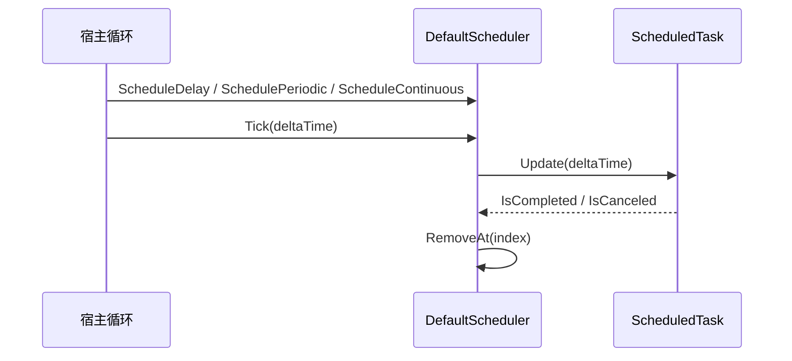

# Ability-Kit Timer 定时器与调度模块开发设计文档

> **阅读对象**：需要在逻辑层、控制台环境、Unity Update 或未来 MonoGame 环境中接入定时任务的框架开发者。
>
> **文档目标**：说明 Timer 模块的调度器、任务模型和外部 Tick 驱动方式，明确它与 Unity 协程、系统线程计时器的边界。

---

## 一、设计理念：为什么需要 Timer 模块

Timer 模块提供与运行环境解耦的定时任务调度能力。它不依赖 Unity `MonoBehaviour.Update`，也不主动创建后台线程，而是由宿主传入 `deltaTime` 推进任务。

这种设计适合：

- 纯逻辑示例和控制台程序。
- 战斗模拟和 deterministic runtime。
- Unity/MonoGame 等外部循环驱动环境。
- 需要集中取消、命名管理、批量 Tick 的轻量定时逻辑。

核心思想是：调度器只保存任务并响应 `Tick(deltaTime)`，时间来源由宿主决定。

---

## 二、模块边界

### 2.1 Timer 负责什么

- 定义调度器接口 `IScheduler`。
- 提供默认调度器 `DefaultScheduler`。
- 支持延时、周期、持续三类任务。
- 提供任务状态、取消、完成判断。
- 提供 `SystemTimer` 作为更简单的计时封装。

### 2.2 Timer 不负责什么

- 不负责启动线程或自动调用 Tick。
- 不负责 Unity 协程、YieldInstruction 或 MonoBehaviour 生命周期。
- 不负责任务持久化和序列化。
- 不负责多线程安全调度。
- 不负责高精度系统时钟校准，精度取决于宿主传入的 deltaTime。

---

## 三、目录结构

| 路径 | 职责 |
|------|------|
| `Runtime/Core/Interfaces/IScheduler.cs` | 调度器接口 |
| `Runtime/Core/Interfaces/IScheduledTask.cs` | 任务接口 |
| `Runtime/Core/Interfaces/ISimpleTask.cs` | 简单任务接口 |
| `Runtime/Core/Interfaces/ITimer.cs` | Timer 抽象 |
| `Runtime/Core/Interfaces/TaskState.cs` | 任务状态枚举 |
| `Runtime/Core/Scheduler/DefaultScheduler.cs` | 默认调度器 |
| `Runtime/Core/Scheduler/TaskList.cs` | 任务列表容器 |
| `Runtime/Core/Tasks/ScheduledTaskBase.cs` | 任务基类 |
| `Runtime/Core/Tasks/DelayTask.cs` | 延时任务 |
| `Runtime/Core/Tasks/PeriodicTask.cs` | 周期任务 |
| `Runtime/Core/Tasks/ContinuousTask.cs` | 持续任务 |
| `Runtime/Core/Timer/SystemTimer.cs` | 简单系统计时器 |
| `Runtime/Unity/` | Unity 适配预留目录 |

当前包根目录存在 `Documentation/`，但主要设计文档统一放在 `Document/` 下。

---

## 四、核心类型与职责

### 4.1 IScheduler

`IScheduler` 是调度器统一接口：

| API | 行为 |
|-----|------|
| `Name` | 调度器名称 |
| `Count` | 当前任务数量 |
| `ScheduleDelay(callback, delaySeconds)` | 延迟执行一次 |
| `SchedulePeriodic(callback, periodSeconds, durationSeconds, maxExecutions)` | 固定间隔重复执行 |
| `ScheduleContinuous(onTick, onComplete, durationSeconds)` | 每次 Tick 执行，直到取消或持续时间结束 |
| `CancelAll()` | 请求取消全部任务 |
| `CancelByName(name)` | 按任务名称请求取消 |
| `Tick(deltaTime)` | 推进所有任务 |

### 4.2 DefaultScheduler

`DefaultScheduler` 内部持有 `TaskList _tasks`。每次 `Tick(deltaTime)` 倒序遍历任务：

1. 调用 `task.Update(deltaTime)`。
2. 如果任务完成或取消，从列表移除。

倒序遍历可以安全移除当前任务，不影响尚未处理的索引。

### 4.3 ScheduledTaskBase

任务基类提供共同状态：

- 名称。
- 已取消标记。
- 已完成标记。
- 取消原因。
- `RequestCancel(reason)` 等通用行为。

具体任务通过覆写 `Update`、`State`、`ElapsedTime`、`Duration` 等成员表达自己的生命周期。

### 4.4 DelayTask

`DelayTask` 累积 elapsed，当 elapsed 达到 delay 后执行 callback 并完成。适合“几秒后执行一次”的逻辑，例如技能冷却结束提示、延迟销毁、延迟派发事件。

### 4.5 PeriodicTask

`PeriodicTask` 按 `_period` 重复执行 callback，并支持：

- `durationSeconds`：总持续限制，-1 表示无限。
- `maxExecutions`：最大执行次数，-1 表示无限。

当前实现每次触发后会执行 `_elapsed -= _period`。这使 `_elapsed` 更像“距离下一次触发的累计时间”，而不是完整生命周期累计时间。与此同时，`State` 中又用 `_elapsed >= _duration` 判断持续时间，这会导致有限 duration 的语义不够准确。后续建议拆分 `_periodElapsed` 与 `_totalElapsed`。

### 4.6 ContinuousTask

`ContinuousTask` 每次 Update 调用 `onTick(deltaTime)`，在达到持续时间或被取消时结束，并可调用 `onComplete`。适合需要逐帧推进的轻量任务，例如进度条、持续效果、模拟器中的状态更新。

### 4.7 TaskList

`TaskList` 是调度器内部容器，负责保存 `IScheduledTask` 并支持按索引访问、添加和移除。当前调度器没有暴露任务枚举接口，外部主要通过任务句柄和取消 API 控制。

---

## 五、执行流程



Timer 模块的关键点是外部驱动。Unity 中可以在 `Update()` 调用 `scheduler.Tick(Time.deltaTime)`；控制台或测试环境中可以手动传入固定步长；MonoGame 中可以使用 `GameTime.ElapsedGameTime.TotalSeconds`。

---

## 六、扩展点

- 自定义调度器：实现 `IScheduler`，可以接入优先级、分组、暂停、时间缩放。
- 自定义任务：继承 `ScheduledTaskBase`，实现自己的 `Update` 和完成条件。
- Unity 适配：在 `Runtime/Unity` 下增加 MonoBehaviour 驱动器。
- 逻辑环境适配：为控制台、测试、MonoGame 提供统一 host wrapper。
- 诊断扩展：为任务执行耗时、任务数量、取消原因增加追踪输出。

---

## 七、使用示例

```csharp
var scheduler = new DefaultScheduler();

scheduler.ScheduleDelay(
    () => Console.WriteLine("delay done"),
    delaySeconds: 2f);

scheduler.SchedulePeriodic(
    () => Console.WriteLine("tick"),
    periodSeconds: 1f,
    maxExecutions: 3);

for (var i = 0; i < 180; i++)
{
    scheduler.Tick(1f / 60f);
}
```

持续任务：

```csharp
scheduler.ScheduleContinuous(
    onTick: dt => Console.WriteLine($"update {dt}"),
    onComplete: () => Console.WriteLine("complete"),
    durationSeconds: 5f);
```

---

## 八、注意事项与当前限制

- 当前 `com.abilitykit.timer` 的 `Runtime` 下未看到 asmdef 文件；若 Unity 包独立导入，需要补充 assembly definition 或确认由上层 asmdef 覆盖。
- 调度器不是线程安全容器，建议在同一逻辑线程内调用 Schedule/Cancel/Tick。
- `PeriodicTask` 的 `_elapsed` 同时承担周期累计和持续时间判断，有限 duration 场景可能不符合预期。
- `CancelAll` 和 `CancelByName` 是请求取消，任务会在下一次 Tick 后被移除。
- 如果 callback 抛异常，当前任务实现是否捕获取决于具体任务代码；调用方应根据场景加保护。
- `DefaultScheduler` 没有暂停、恢复、时间缩放、任务分组等能力，后续可扩展。

---

## 九、后续演进

- 为 Runtime 补充 asmdef，明确 Unity 包编译边界。
- 修正 `PeriodicTask` 的总时长统计，拆分周期 elapsed 和 total elapsed。
- 增加任务分组、暂停、恢复、时间缩放。
- 增加调度器诊断信息，例如任务数量、执行耗时、取消原因统计。
- 为 Unity、控制台、MonoGame 提供示例 host，展示同一逻辑定时器如何在不同环境中运行。

---

*文档版本：1.0*  
*最后更新：2026-06-05*
