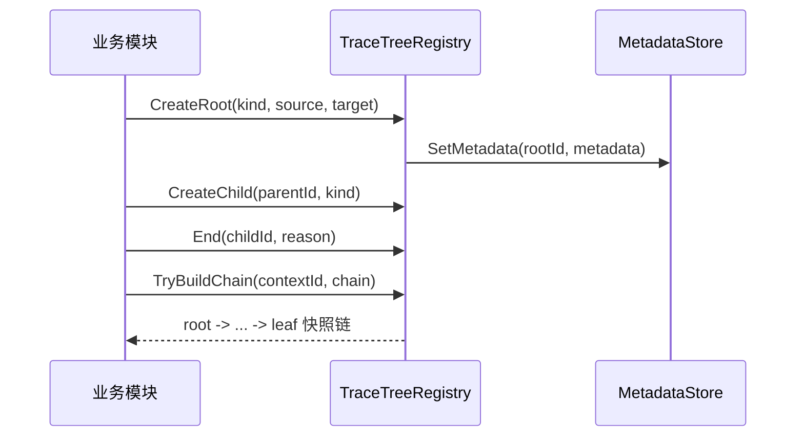

# Ability-Kit Trace 溯源树模块开发设计文档

> **阅读对象**：需要追踪技能、伤害、Buff、投射物等效果来源链路的框架开发者。
>
> **文档目标**：说明 Trace 包如何构建溯源树、保存根节点元数据、查询链路和清理生命周期。

---

## 一、设计理念

Trace 模块用于回答“这个结果从哪里来”。在战斗系统里，一个伤害可能来自技能，技能可能来自 Buff，Buff 又可能来自装备或区域效果。若只保存最终数值，排查和回放时很难还原因果链。

Trace 的方案是把一次效果来源记录为树：

- 根节点表示一次独立来源，例如一次技能释放。
- 子节点表示派生来源，例如投射物、命中、二段伤害。
- 根节点元数据由业务层定义，框架只保存树结构和生命周期。
- 叶子节点可以挂载额外快照数据，用于调试或回放。

---

## 二、模块边界

Trace 负责：

- 创建 root/child 溯源节点。
- 记录 parent/root/kind/endFrame/endReason。
- 通过 `TraceMetadata` 扩展业务元数据。
- 查询 root 状态、节点链路、按 kind/root 枚举节点。
- 结束节点、结束整棵树、按保留帧数清理已结束 root。

Trace 不负责：

- 不定义具体战斗语义，`TraceNodeKind` 和 `TraceEndReason` 只保留 `None`。
- 不负责序列化和持久化。
- 不主动 Tick，当前帧号由子类覆写 `Frame` 提供。
- 不保证线程安全，当前内部字典没有锁。

---

## 三、目录结构

| 路径 | 职责 |
|------|------|
| `Runtime/TraceTreeRegistry.Core.cs` | 溯源树注册表核心实现 |
| `Runtime/TraceTreeScope.cs` | Begin/End 作用域辅助 |
| `Runtime/TraceSnapshot.cs` | 泛型节点快照和查询返回结构 |
| `Runtime/TraceRegistryRuntime.cs` | 运行时注册目录、生命周期事件、非泛型节点视图 |
| `Runtime/TraceOrigin.cs` | 创建节点时的来源参数 |
| `Runtime/TraceInterfaces.cs` | 元数据、叶子数据、上下文来源、状态模型 |
| `Editor/Windows` | Trace Tree 编辑器窗口和 ViewModel |
| `Editor/Plugins` | 节点详情、树可视化插件 |
| `Editor/Config` | TraceTree 编辑器配置 |

---

## 四、核心类型

### 4.1 TraceTreeRegistryBase

非泛型基类保存框架必要结构：

- `_contexts`：`contextId -> TraceContextRecord`。
- `_roots`：`rootId -> TraceRootRecord`。
- `_childrenByParent`：父子关系。
- `_contextSource`：从任意 origin 对象提取 trace id。
- `_leafDataStore`：叶子节点附加数据。

它提供 `End`、`EndRoot`、`RetainRoot`、`ReleaseRoot`、`Clear` 等基础生命周期能力，同时暴露非泛型查询面：

- `GetActiveRoots()` / `GetEndedRoots()`：枚举 root 状态，不需要知道业务元数据类型。
- `TryGetNodeSnapshot()` / `GetNodeSnapshotsByRoot()`：返回 `TraceNodeSnapshot`，供 Editor、Diagnostics、导出工具等跨业务消费。
- `RegistryEvent`：发布 root/child 创建、节点结束、root 引用变化、清理等生命周期事件。
- `GetKindName()`：业务注册表可覆写，用于工具层展示稳定节点类型名称。

### 4.2 TraceTreeRegistry<T>

泛型注册表增加业务元数据：

```csharp
public abstract class TraceTreeRegistry<T> : TraceTreeRegistryBase
    where T : TraceMetadata
```

业务侧需要实现 `CreateMetadata`，并可覆写 `GetSourceActorId`、`GetOriginSourceId` 等方法，让子节点在未显式传入来源时继承 root 元数据。

### 4.3 TraceSnapshot<T> 与 TraceNodeSnapshot

`TraceSnapshot<T>` 是业务代码使用的强类型查询结果，包含节点 ID、root ID、parent ID、kind、结束帧、结束原因、子节点数量和 root 元数据。它是只读视图，不承担写回。

`TraceNodeSnapshot` 是非泛型只读视图，`Metadata` 以 `object` 暴露，主要用于 Editor、Diagnostics、日志导出等无需引用业务元数据泛型的工具场景。

### 4.4 TraceRegistryDirectory 与事件

`TraceRegistryDirectory` 维护当前运行时可见的 `TraceTreeRegistryBase` 实例。注册表构造时会自动注册，`Dispose()` 时自动移除；业务也可以显式调用 `Register`/`Unregister` 管理生命周期。

`TraceRegistryEvent` 用于订阅溯源树生命周期变化，适合桥接到诊断面板、采样器、遥测或回放工具，而不需要修改具体业务注册表。

### 4.5 元数据和数据存储

- `TraceMetadata`：业务元数据基类。
- `ITraceMetadataStore<T>`：按 rootId 存取元数据。
- `DictionaryTraceMetadataStore<T>`：默认字典实现。
- `ITraceLeafDataStore`：为叶子节点挂载附加数据。
- `SimpleTraceContextSource`：支持 int/long/Guid 等基础 origin 提取。

---

## 五、执行流程



Root 的 `ActiveCount` 会随着节点创建和结束变化。`Purge(currentFrame, keepEndedFrames)` 只会清理 active 为 0 且 external ref 为 0 的 root。工具层可以通过 `TraceRegistryDirectory` 获取注册表，并通过非泛型快照读取树结构，避免对 `TraceTreeRegistry<T>` 做反射调用。

---

## 六、扩展点

- 继承 `TraceMetadata` 定义业务字段，如 SkillId、BuffId、DamageType。
- 继承 `TraceTreeRegistry<T>`，实现 `CreateMetadata`，并按需覆写 `GetKindName`。
- 实现 `ITraceContextSource`，让业务对象提供稳定 trace id 和显示名。
- 实现 `ITraceLeafDataStore`，将叶子快照接入对象池或诊断系统。
- 订阅 `RegistryEvent`，将 Trace 生命周期桥接到诊断、遥测、回放或业务日志。
- 使用 `TraceExportOptions` 控制导出节点上限、active-only、元数据包含、最大深度和导出顺序。
- 扩展 Editor 插件显示不同业务节点详情。

---

## 七、最小接入示例

```csharp
public sealed class BattleTraceRegistry : TraceTreeRegistry<BattleTraceMetadata>
{
    protected override BattleTraceMetadata CreateMetadata(int kind) => new BattleTraceMetadata(kind);
    public override string GetKindName(int kind) => ((BattleTraceKind)kind).ToString();
}

using var trace = new BattleTraceRegistry();
var rootId = trace.CreateRoot((int)BattleTraceKind.Skill);
var childId = trace.CreateChild(rootId, (int)BattleTraceKind.Effect);

var export = trace.ExportRoot(
    rootId,
    new TraceExportOptions(
        maxNodes: 128,
        activeOnly: false,
        includeMetadata: true,
        maxDepth: 4,
        order: TraceExportOrder.TreePreOrder));
```

Trace 包只负责记录“谁触发了谁”的树结构、生命周期和可导出快照；技能、Buff、伤害类型等业务字段放在业务 metadata 中，诊断面板通过 `TraceTreeExportDto` 读取通用结构并自行解释 metadata。

---

## 八、注意事项

- `PurgeRoot` 递归清理时会从 metadata/leaf store 清理同名 ID；如果外部 store 有不同生命周期，需要自定义实现。
- `BeginRoot` / `BeginChild` 会增加 root 外部引用，必须配合释放，否则 `Purge` 不会清理。
- 注册表构造后会进入 `TraceRegistryDirectory`，长生命周期单例无需额外注册；短生命周期实例应调用 `Dispose()` 或显式 `Unregister`。
- `CreateChild` 需要 parent 存在，否则抛出异常。
- 当前 `Frame` 默认返回 0，生产环境应由子类接入宿主帧号。

---

*文档版本：1.1*
*最后更新：2026-06-17*
