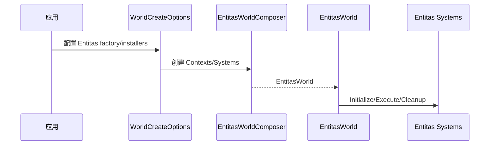

# Ability-Kit World Entitas 世界适配模块开发设计文档

> **阅读对象**：需要把 Entitas ECS 与 AbilityKit World 创建、模块安装、系统执行连接起来的开发者。
>
> **文档目标**：说明 World Entitas 包的世界封装、系统基类、模块安装和扩展点。

---

## 一、设计理念

World Entitas 是 AbilityKit World 对 Entitas ECS 的适配包。它让 Entitas Contexts/Systems 可以被包装成 AbilityKit 的 World，并通过模块安装器、系统排序 Attribute 和创建选项扩展参与 World 生命周期。

---

## 二、模块边界

负责：

- 定义 `IEntitasWorld`、`IEntitasWorldContext`、`IEntitasContextsFactory`。
- 提供 `EntitasWorld`、`EntitasWorldContext`、`EntitasWorldComposer`。
- 提供 `WorldSystemBase`、`ReactiveWorldSystemBase`。
- 提供 `IEntitasSystemsInstaller` 和 `AutoSystemInstaller`。
- 提供 `WorldSystemAttribute`、`WorldSystemOrder`。
- 提供 TickCounter 示例模块。
- 提供 WorldCreateOptions Entitas 扩展。

不负责：

- 不包含 Entitas 第三方源码本身。
- 不定义具体游戏组件。
- 不替代 World DI，只做 Entitas 适配。

---

## 三、典型流程

---

## 四、注意事项

- 系统排序 Attribute 应保持稳定，避免执行顺序隐式变化。
- TickCounter 模块是示例/辅助模块，真实项目可替换。
- Entitas 生成代码和 Contexts factory 由项目侧提供。

---

*文档版本：1.0*  
*最后更新：2026-06-05*
